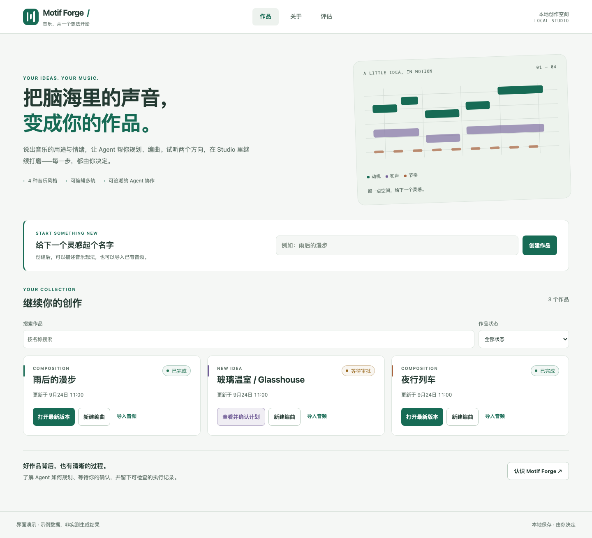
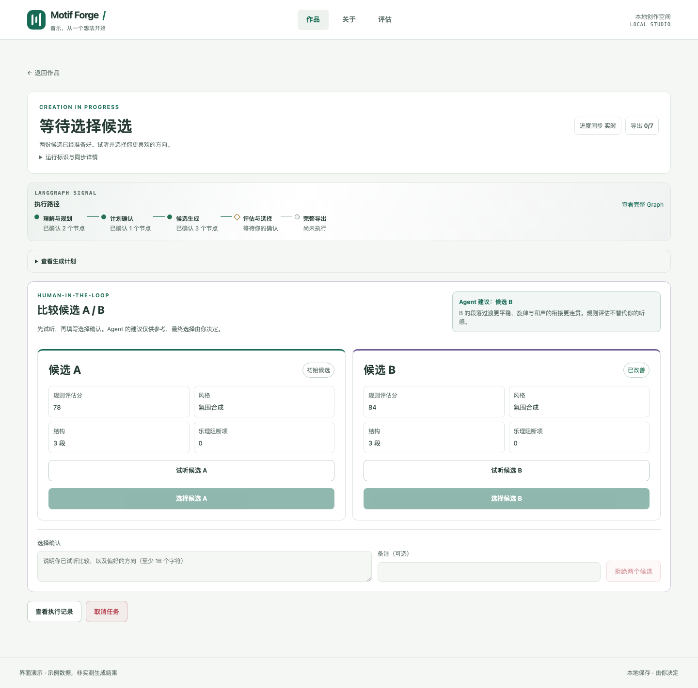
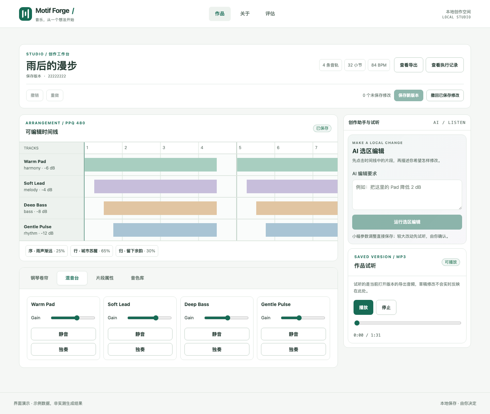
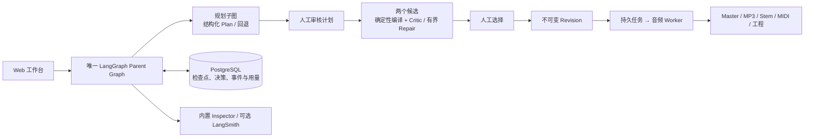
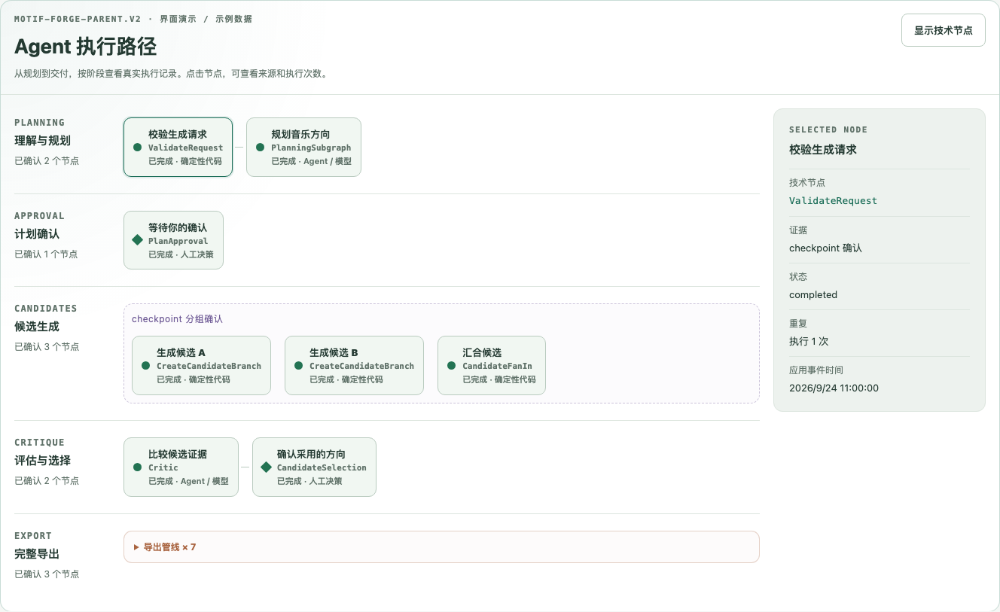

# Motif Forge

### 从一个音乐想法，到一首可以继续编辑的作品。

一个本地优先的 Agentic 音乐工作台。写下创作意图，审核编曲计划，试听两个方向，再把选中的版本带进 Studio：调整音符、修改局部、导出音频，也能回看 Agent 实际走过的执行路径。

**LangGraph 编排 · 人在回路 · 确定性音乐编译 · 可恢复执行**

[快速开始](#快速开始) · [走完一次创作](#走完一次创作) · [Agent 如何工作](#agent-如何工作) · [能力与边界](#能力与边界) · [开发文档](#开发文档)



> 本页截图由实际前端渲染，使用隔离的示例数据展示界面，不是本轮真实模型生成或音质验收结果。复现方式见[界面验证](docs/DEVELOPMENT.md#界面验证与截图)。

## 不止是“输入一句话，等待一段音频”

Motif Forge 把创作过程保留下来：计划、候选、人工决定、编排结构和导出结果都有明确的位置。你可以改变方向，也可以看清系统做了什么、在哪里等待、为什么失败。

- **先讨论编曲，再生成作品。** Brief 支持用途、情绪、时长与四个 Style Pack；Plan 展示结构和轨道安排，可以调整后再批准。
- **两个方向，由你选。** A/B 候选带有试听、规则评估与有界修复结果；只有明确选中的候选会成为正式版本。
- **把生成结果变成可编辑工程。** 轻量 Timeline、Piano Roll、Mixer 与音色面板支持草稿和版本保存；AI 修改限定在选区内，高影响改动先试听再审批。
- **带入自己的声音。** 导入 WAV、MP3、FLAC 或多个 Stem，确认素材权利，核对 BPM/调性，再选择是否保持音高地对齐。
- **带走完整交付。** 下载 Master WAV、试听 MP3、分轨、MIDI 和工程文件；导出部分失败时，已完成文件仍可查看和下载。
- **看得见的 Agent。** 内置 Graph Inspector 展示持久证据、决策、任务和模型用量；可选 LangSmith 用于开发追踪，不替代本地事实。

### 审核方向，而不只看一个进度条



### 留在作品里继续编辑



Studio 的试听器播放**已渲染的保存版本**，不是未保存草稿的实时合成监听。移动端侧重查看、试听和审批，精细编辑请使用桌面浏览器。

## 快速开始

当前 **S1–S7** 已完成个人作品集级的核心闭环。默认演示不需要模型 Key；这不是多租户在线服务，也不是专业 DAW 的替代品。

首次获取：

```bash
git clone https://github.com/Oliveryfaso/Agentic-Music-Studio.git
cd Agentic-Music-Studio
scripts/start_motif_forge.sh
```

已有仓库时，在仓库根目录直接运行 `scripts/start_motif_forge.sh` 即可。

启动器会准备本地配置和外置存储目录，在需要时启动 Colima，拉起数据库、队列和音频服务，等待就绪后启动前端并打开 **http://127.0.0.1:5173**。首次启动可能安装前端依赖或构建镜像，后续启动会复用已有内容。

结束使用：

```bash
scripts/stop_motif_forge.sh
```

停止脚本会关闭本项目前端、Compose 服务以及默认 Colima 虚拟机，**保留数据库卷、镜像、导入素材、作品和导出文件**。如果其他项目共用该 Colima 实例，它们也会随虚拟机暂停；只按启动终端的 `Ctrl+C` 则仅停止前端，后台服务仍在运行。

可选命令：

```bash
scripts/start_motif_forge.sh --check    # 只检查启动条件，不启动服务
scripts/start_motif_forge.sh --no-open # 启动，但不自动打开浏览器
```

> **默认不会调用付费模型。** 标准 Compose 配置显式清空 DeepSeek Key，使用确定性回退规划，也可以走完审批、候选、渲染和导出。页面会标明回退来源，不将其包装成模型结果。付费 Provider 验证属于单独、显式启用的开发流程，仅往 `.env` 填 Key 不会改变这一默认边界。

## Prerequisites · 运行前准备

当前一键路径在 **macOS / Apple Silicon + Colima** 上验证；其他系统的 Docker 路径需自行验证。

| 用途 | 准备 |
| --- | --- |
| 前端 | Node.js 22.12+ 与 npm |
| 后台服务 | Docker CLI、Compose、Buildx；可用 Docker Desktop，或安装 Colima |
| 本地数据 | 可写的存储目录与足够的镜像、音频空间；启动器默认使用仓库旁的 `.motif-forge-data` |
| 仅后端开发 | Python 3.12 与 uv；正常容器运行不要求宿主机安装 Python |
| 可选服务 | DeepSeek 用于显式付费模型验证；LangSmith 用于可选开发追踪 |

配置保存在未跟踪的 `.env` 中，不要提交 Key，也不要放进前端 `VITE_*` 变量。默认入口面向本机使用，未配置公共托管所需的认证与隔离。

启动失败、端口占用、外置盘或代理问题，请看[开发与排障指南](docs/DEVELOPMENT.md)。

## 走完一次创作

1. **建立作品。** 首页输入名称，创建后点击「开始创作」；已有作品也可以继续编曲、打开 Studio 或导入素材。
2. **写下 Brief。** 选择风格，描述用途、情绪和时长。需要指定速度、调性或结构时，再展开高级约束。
3. **审核 Plan。** 看清段落与配器；不满意就重新规划。填写审批身份和明确的确认说明，再「批准并生成」。
4. **比较 A/B。** 分别试听，查看结构和规则评估。填写选择确认后选定候选；规则分不是对音乐审美的客观评级。
5. **进入 Studio。** 等正式版本和导出就绪后打开 Studio。手工修改先形成草稿，再保存新版本；AI 修改先选中目标，高影响修改仍需预览确认。
6. **导出或检查执行。** 到导出页下载文件；到运行检查页查看 Graph、人工决策、后台任务和用量。刷新页面后可以继续查看同一次任务。

也可以从「导入音频」开始。逐个确认素材使用权；对低置信度分析，可确认、修正、跳过对齐或取消，不会强迫接受自动判断。

## Agent 如何工作

这里的 Agent 不是直接写音频文件的聊天包装器。**模型负责提出受限计划，确定性代码负责把计划变成音乐和可靠的工程事实。**



这是主创作路径的示意，不是额外的生产 Graph。导入、AI 选区修改与恢复也挂在同一 Parent Graph 中；Redis/Celery 分发音频任务，Chromium/Tone.js 渲染，FFmpeg 处理媒体。

| 设计点 | 为什么这样做 |
| --- | --- |
| 一个 Parent Graph，受限子图 | 统一路由、暂停、恢复和取消，避免几套编排互相漂移 |
| 结构化模型输出 + 确定性编译 | 模型不直接写 Revision；音乐时序、理论规则、事务和预算由代码把关 |
| 真实 HITL | 计划、候选与高影响编辑有明确人工决策，不用前端按钮假装审批 |
| 不可变 Revision | 草稿、试听候选和正式版本分开；撤销也保留历史 |
| 持久 Outbox / Inbox / checkpoint | 已完成的任务与人工决定可重放，限制重复副作用和重复模型花费 |
| 安全可观测性 | 用持久证据解释执行，不暴露 Prompt、审批断言、密钥或媒体内容 |



内置 Graph 不是动画模拟器：节点状态来自受限的 checkpoint 路径和应用事件。无法确认的节点保留未确认状态；Import/Edit 保留其事件时间线。需要模型调用的开发追踪时，参阅 [LangSmith 配置](docs/LANGSMITH.md)。

## 能力与边界

### 四个音乐方向

| Style Pack | 编曲倾向 |
| --- | --- |
| Synth Ambient | 合成器铺底、缓慢演变、空间氛围 |
| Minimal Electronic | 重复动机、低频脉冲与节奏推进 |
| Classical Chamber | 声部组织、动机与和声推进 |
| Jazz Harmony & Improvisation | 和声色彩、律动与伴奏关系 |

当前使用轻量内置音色：12 个语义音色别名映射到 3 个合成核心与 click sample。风格侧重编曲策略，**不代表真实钢琴、弦乐或爵士管乐采样库**。

### 有证据，也保留未验证项

- S7 版本化内部 Eval inventory 为 **96 条**：**80 条实测通过、13 条预期拒绝、3 条未测**；不能写成 96/96 全部生成成功。
- 真实 DeepSeek Generate 历史验收包含 **1 次调用、4,911 tokens**；它是历史样本，不代表每次生成的成本或本轮调用。
- 付费 AI Edit planner 尚未完成真实验收；无 Key 编辑回退只支持明确的 gain / 本地音色意图。
- 完整专业 DAW、自动人声/分轨分离、多人协作、公开托管、生产 P95 与规模化主观音质评估不在当前完成声明中。
- 长时作品、轨道上限和其他最终目标，以[实施状态](docs/IMPLEMENTATION_STATUS.md)中的证据与缺口为准，不把设计目标当作已验证指标。

查看 [Eval 报告](docs/evals/S7_EVAL_REPORT.md)、[最终产品合同](docs/PROJECT_GUIDE.md)和[当前实施状态](docs/IMPLEMENTATION_STATUS.md)。

## 开发文档

| 文档 | 适合什么时候看 |
| --- | --- |
| [开发与排障](docs/DEVELOPMENT.md) | 安装开发环境、跑测试、复现截图、处理启动问题 |
| [可选 LangSmith](docs/LANGSMITH.md) | 接入追踪，理解记录范围与费用边界 |
| [项目总指南](docs/PROJECT_GUIDE.md) | 理解最终产品和架构合同 |
| [决策记录](docs/DECISION_LOG.md) | 理解为什么采用单 Graph、HITL 和不可变版本 |
| [前端体验规范](docs/FRONTEND_UX_SPEC.md) | 页面状态、桌面/移动边界和浅色视觉系统 |
| [实施状态](docs/IMPLEMENTATION_STATUS.md) | 区分已实现、部分完成与尚未验证 |
| [技术演进](docs/TECH_EVOLUTION.md) | 查阅阶段证据、历史问题与修复 |
| [后续路线](docs/NEXT_DEVELOPMENT_ROADMAP.md) | 风险触发后的开发顺序，而非无止境硬化 |

主要目录：`apps/web`（React 工作台）、`services/api`（API / Agent / 持久化）、`packages`（共享音频与类型）、`scripts`（启动与验收）、`docs`（合同与证据）。

---

这是一个以 **Agent / LangGraph 工程实践**为核心的个人作品集。重点是让创作闭环真正可运行、可理解、可恢复，同时诚实呈现音乐能力和验证范围。
