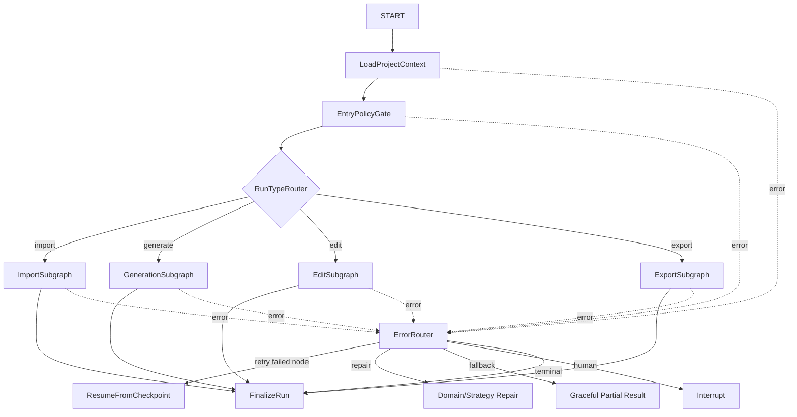
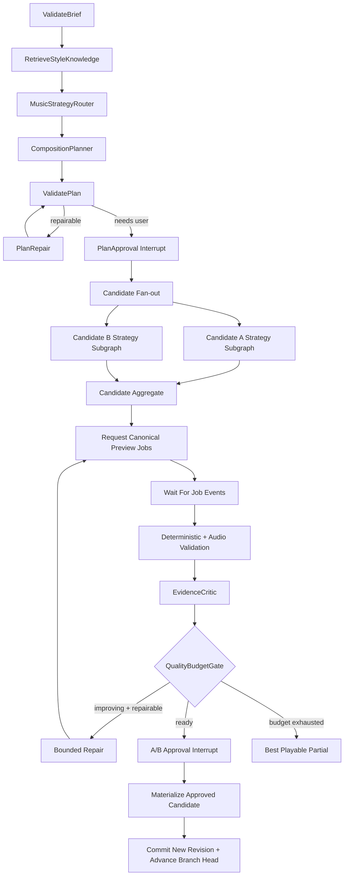

# Motif Forge Agent Graph 规范

> 状态：首版 Graph 合同
> Graph 名称：`MotifForgeGraph`
> 基础模型：`deepseek-v4-flash`

## 1. Graph 的边界

系统编译一个版本化 Parent Graph 拓扑，但每个用户任务创建新的有限 `run_id + thread_id`：

- `import`
- `generate`
- `edit`
- `export`
- `recovery` 不是独立用户类型，而是上述 Run 的统一错误路径

项目状态通过 `project_id + base_revision_id` 载入，不依赖上一个 Run 的 checkpoint。Run 之间用 `parent_run_id` 和 Revision lineage 关联。

一个 Run 内，策略子图、Segment fan-out、Worker 等待、HITL 与异常处理都属于同一 thread；不能另起隐藏 Graph 处理失败或审批。

## 2. Graph State

State 只保存 JSON 可序列化的小对象和引用。

### 2.1 State 分组

| 分组 | 字段 |
|---|---|
| `identity` | run/project/thread/parent_run、actor、graph/state schema versions |
| `request` | run_type、intent、selection、locked ranges、brief refs |
| `project_context` | active/target branch、base/head revision refs、IR summary、import/analysis refs |
| `strategy` | primary strategy、secondary influences、style/knowledge refs |
| `composition` | plan ref/status、motif/harmony summaries |
| `work` | candidates、segments、jobs、artifact/analysis refs |
| `change` | predicted/actual impact、proposal/candidate snapshot/preview refs、non-target hash |
| `approval` | pending interrupt、decision、checkpoint ref |
| `control` | phase、next route、cancel flag、partial outcome、last successful node |
| `budget` | profile ref、usage ledger ref、remaining model/render/deadline budget |
| `failure` | current error ref、retry decision、attempt keys、unresolved issue refs |
| `outcome` | selected candidate、committed revision、export refs、terminal status |

完整 `ArrangementIR`、WAV、波形、长知识文本、完整 Event history、完整 model messages 不进入 Graph State。

### 2.2 Reducer 规则

| Channel | Reducer | 冲突规则 |
|---|---|---|
| `work.candidates` | 按 `candidate_id` 合并 map | 同 ID 不同 hash → error |
| `work.segments` | 按 `segment_id` 合并 map | 状态只能按状态机前进 |
| `work.jobs` | 按 `job_id` 合并 map | 重复完成按 event ID 去重 |
| `failure.unresolved_issue_refs` | 稳定 ID 去重集合 | 严重度可升不可降 |
| `approval` | 单值覆盖 | 仅当前 checkpoint 可写 |
| `control` | 单值覆盖 | 节点只能更新声明字段 |
| `budget` | 从 Usage Ledger 投影 | 禁止简单整数累加导致 replay 重复计费 |

模型调用和 Worker 使用量写入 PostgreSQL Usage Ledger，键为稳定 `operation_id`。BudgetGate 读取去重后的投影；不得依赖 `operator.add` 在 checkpoint 重放中累计费用。

## 3. NodeResult

每个 Node 返回：

- `status = success | partial | waiting | failed | cancelled`
- `state_update`
- `event_specs[]`
- `artifact_refs[]`
- `warnings[]`
- 可选 `error_ref`

Node 不返回任意异常文本控制 Edge。未捕获异常由 Node boundary 转成 `ErrorEnvelope` 并进入统一 Error Router。

## 4. 顶层拓扑



顶层 Router 只根据已验证 `run_type` 路由，不调用模型。

## 5. ImportSubgraph

```text
ValidateUploadRefs
→ ImportPolicyNode
→ EnqueueIngestJob
→ WaitForJobEvent
→ IngestResultGate
→ AnalyzeConfidenceGate
→ [low confidence] AnalysisConfirmationInterrupt
→ AlignmentDecision
→ [needed] EnqueueTimeStretchJob
→ WaitForJobEvent
→ TimeStretchQualityGate
→ BuildImportCommands
→ CommitImportRevision
```

- Upload、格式、大小、许可、置信度、time-stretch quality 都由规则节点决定。
- DeepSeek 不参与解码、BPM/key 数值判断或保持音高算法。
- Worker 失败只恢复对应 Job，不重做成功的 Upload/Ingest Artifact。

## 6. GenerationSubgraph



### 6.1 Candidate/Segment 并发

- 两个 Candidate 使用不同 `candidate_id`、seed 和局部 state。
- Candidate 内按 Section/Track 建立 Segment DAG；依赖骨架先于旋律/纹理。
- fan-in 结果按稳定 ID 排序后进入 reducer，不能使用返回顺序。
- 结构生成可以并发；完整 Chromium 渲染默认并发 1，由 Render Policy 决定。

## 7. 策略子图

四个子图共享 `StrategyInput/StrategyResult`，但节点和 Loop 不同。

| 策略 | 主要 Node | 改善指标 |
|---|---|---|
| Synth Ambient | Palette → Envelope/Filter → Texture → Spatial | 密度、频谱、尾音、削波 |
| Minimal Electronic | Groove → Drum/Bass Lock → Energy → Transition | onset grid、低频冲突、段落对比 |
| Classical Chamber | Form → Harmony → Voice Assignment → Phrase | voice leading、终止式、音域、可演奏性 |
| Jazz | Changes → Voicing → Rhythm Section → Melody/Improvisation | guide tone、tension、swing、动机连续性 |

`MusicStrategyRouter` 可以使用 DeepSeek thinking 模式理解混合风格，但输出必须是 Allowlist strategy ID。规则验证不允许模型生成任意节点名或 Edge。

## 8. EditSubgraph

```text
ParseEditIntent
→ PredictChangeImpact
→ EditPlanner
→ simulate_edit_patch
→ ValidatePatchAndLocks
→ ComputeActualDiffAndImpact
→ route max(predicted, actual, policy)
   ├─ L0/L1 → CommitRevision → RequestAffectedRangeRender
   └─ L2/L3 → PersistCandidateSnapshot → CreatePreviewCandidate
              → RequestPreviewRender → PreviewApprovalInterrupt
                    ├─ approve → MaterializeCandidateAsRevision → AdvanceTargetBranchHead
                    ├─ reject → RejectPreviewCandidate
                    └─ branch → CreateBranch → MaterializeCandidateAsRevision
```

`simulate_edit_patch` 是纯函数/只读 Tool。PreviewCandidate 不是 Revision；批准时从其不可变 Candidate Snapshot 创建新的 Revision。`CommitRevision`、`MaterializeCandidateAsRevision`、`RequestPreviewRender` 和审批 Node 不在模型工具列表中。

## 9. ExportSubgraph

```text
PinRequestedRevision
→ ValidateExportAssetsAndLicenses
→ BuildAudioGraphSpec
→ EnqueueMaster/Stem Render Jobs
→ WaitForJobEvents
→ RenderQualityGate
→ EnqueueTranscode/Manifest Jobs
→ ExportCompletenessGate
→ FinalizeExport
```

导出期间固定 Revision；active branch 或任意 Branch head 变化不会改变正在导出的内容。

## 10. Worker 等待与恢复

Graph 不在节点中轮询长 Job：

1. `Enqueue*Job` 通过 Application Service 原子写 Job + Outbox。
2. Node 保存 `job_id` 后进入可恢复等待状态并结束当前执行。
3. Worker 写持久 `job.completed/failed` 事件。
4. Resume Dispatcher 对事件执行 inbox 去重，读取 Run 当前 checkpoint。
5. 以同一个 `thread_id` 和 `job_event_ref` 恢复 Graph。
6. `IngestJobEvent` 校验 job/run/checkpoint 匹配，再路由下一节点。

迟到事件、重复事件或已取消 Run 的事件只更新审计，不重新推进 Graph。

## 11. DeepSeek Node 合同

| Node | 模式 | 输出 | 工具 |
|---|---|---|---|
| Intent/简单编辑解析 | non-thinking | `EditIntent` | 无或只读 catalog |
| MusicStrategyRouter | thinking high | `StrategySelection` | 只读 style metadata |
| CompositionPlanner | thinking high | `CompositionPlan` | `search_style_knowledge` |
| ArrangementPlanner | thinking high | `PatternSpec[]/SynthPatchSpec[]` | 只读 catalog + 确定性 composer tools |
| RepairPlanner | thinking high/受限 | `EditPatchProposal` | `simulate_edit_patch` 前置工具 |
| EvidenceCritic | thinking high | `Critique` | 只读 analysis/version evidence |
| 用户摘要 | non-thinking | 短结构化摘要 | 无 |

共同规则：

- 显式指定 `deepseek-v4-flash` 和 thinking 模式。
- JSON Output + Pydantic 二次校验；只接受 `finish_reason=stop` 的最终对象。
- Tool turn 必须在 Provider Adapter 内完整保存并回传 `reasoning_content`；UI、普通 log、trace 不记录该内容。
- 每个 Node 固定 prompt/schema/toolset/max output/timeout/budget version。
- `length` 结果丢弃并缩小 Segment；不得拼接半截 JSON。
- HITL 只能发生在 Provider Turn 完成后。

## 12. Agent Tool Allowlist

### 12.1 只读/纯函数工具

- `search_style_knowledge`
- `search_sound_catalog`
- `validate_synth_patch`
- `realize_chords`
- `generate_motif`：确定性、需要 seed
- `voice_lead`
- `compile_pattern`
- `simulate_edit_patch`
- `analyze_audio_summary`
- `compare_versions`

### 12.2 Graph/Application 专用命令

- `commit_revision`
- `persist_candidate_snapshot`
- `create_preview_candidate`
- `materialize_candidate`
- `set_sections/set_markers/set_project_key`
- `request_preview_render`
- `enqueue_worker_job`
- `schedule_retry`
- `resume_run`
- `approve/reject_preview_candidate`
- `download_external_asset`

这些命令不出现在 DeepSeek Tool Schema 中。

## 13. Error Router 与重试所有权

| 错误 | 所有者 | 路由 |
|---|---|---|
| DeepSeek connect/read timeout、429、5xx | Provider Client | bounded backoff，最多策略次数 |
| DeepSeek schema/length | Graph | 一次 repair 或缩小 Segment |
| 401/402/403 | Human | interrupt 修复配置 |
| Domain validation | Domain/Strategy Repair | 结构化 issue，不做 HTTP retry |
| Celery process crash | Celery/Job Reconciler | 同 idempotency key 重投 |
| Artifact checksum/codec/license | Rule/Human | 隔离、替代或终止 |
| Revision conflict | User/Application | 409，重新模拟；不自动覆盖 |
| Budget exhausted | Graph | 保留最佳可播放结果 |

同一错误不能同时由 Provider、Celery 和 Graph 各重试 3 次。`ErrorEnvelope.retry_owner` 必须唯一。

## 14. Checkpoint 与 HITL

必须 checkpoint：

- Plan Approval 前。
- Candidate/Segment fan-out 前。
- Job 入队后、等待事件前。
- 每批 Segment 聚合后。
- 每轮 Critic/Repair 后。
- A/B、Preview、低置信度分析和超预算审批前。
- 最终提交/导出前。

Interrupt payload 只含 JSON 摘要、引用、选项、截止时间；不含音频、完整 IR 或 Secret。Resume 必须携带 `interrupt_id + expected_checkpoint_id`。

## 15. 终止条件

Run 在以下条件之一结束：

- 用户批准并完成提交/导出。
- 用户取消或拒绝且不保留分支。
- 达到模型、token、成本、render seconds、deadline 或 Revision 预算。
- 连续两轮可比较指标无改善。
- 资源、许可、Schema 迁移或安全问题不可恢复。

LangGraph recursion limit 只是最后保护，不能替代业务终止条件。

## 16. Graph 版本兼容

- Run 创建时固定 `graph_topology_version` 和 `state_schema_version`。
- 部署新 Graph 时列出 in-flight Run；重命名/删除 checkpoint 下一节点前必须提供迁移。
- Resume Dispatcher 发现版本不兼容时进入 `GRAPH_VERSION_INCOMPATIBLE` 人工/终止路径。
- 新版本不得静默重放已产生外部副作用的 Node。

## 17. Graph 测试矩阵

- 每个条件 Edge 的路由单测。
- Candidate/Segment reducer 顺序独立性。
- checkpoint/resume 与 duplicate job event。
- HITL 重复批准、过期 checkpoint、Branch head/Revision conflict。
- Provider timeout、length、坏 JSON、missing reasoning_content。
- Worker crash、部分候选成功、取消、预算耗尽。
- L0/L1 自动提交与 L2/L3 漏拦截目标为 0。
- Graph 版本升级的 in-flight fixture。
