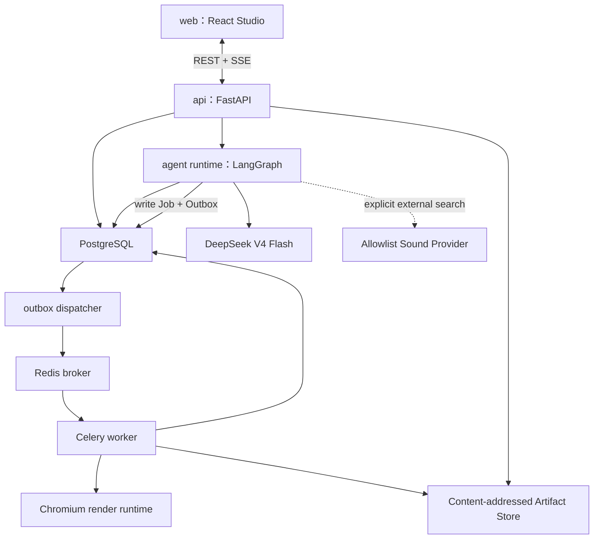
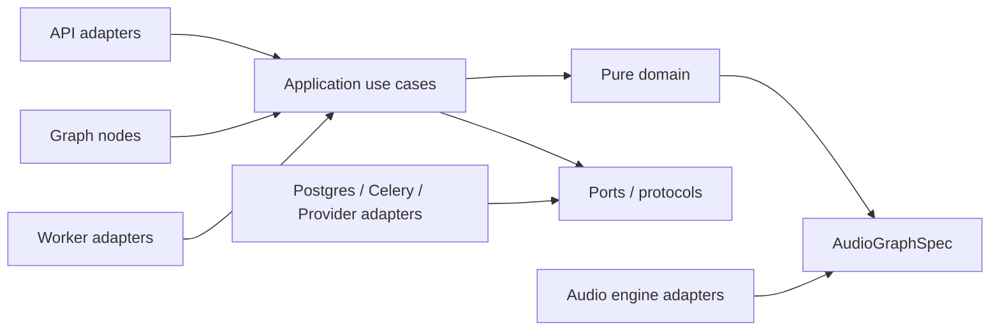

# Motif Forge 代码架构规范

> 状态：首版架构基线
> 依赖决策：[DECISION_LOG.md](./DECISION_LOG.md)
> 本文描述代码应该放在哪里、谁可以调用谁，以及一次操作如何穿过各层。

## 1. 架构目标

首版架构必须同时满足：

- 不依赖 LLM 也能导入、编辑、播放和导出一首完整作品。
- DeepSeek 只做音乐语义和创意决策，所有输出都可验证。
- 一个版本化 Graph 拓扑覆盖导入、生成、编辑、导出、HITL 和异常恢复。
- PostgreSQL Revision 是持久事实，前端状态、Graph checkpoint、Redis 和音频节点都不是项目事实源。
- 浏览器试听与 Worker 导出共用同一个 AudioGraph 编译语义。
- 任意模型、Worker 或网络失败都不会覆盖原始音频或已提交 Revision。

## 2. 运行时组件



首版 Docker Compose 至少包含 `web`、`api`、`worker`、`dispatcher`、`postgres` 和 `redis`。Chromium 可以运行在 `worker` 镜像中；若性能隔离测试表明需要独立资源限制，再拆为单独 `render-worker` 服务，不改变 Job Contract。

## 3. 建议仓库结构

```text
agentic-music-workbench/
  apps/
    web/
      src/
        app/                 # 路由、Provider、全局错误边界
        features/            # import、plan、studio、compare、export、runs
        entities/            # project、revision、track、clip、run、artifact
        audio/               # 浏览器 AudioEngine 与 Transport adapter
        editor/              # command bus、selection、draft、undo/redo
        shared/              # 生成的 API 类型、UI primitives、tokens
  services/
    api/
      src/motif_forge/
        api/                 # FastAPI routers、DTO、SSE
        application/         # use cases、事务、权限、幂等
        domain/              # 纯领域模型、命令、规则、diff、validator
        agent/               # graph、nodes、subgraphs、state、prompts
        providers/           # DeepSeek、外部音色、可选 OTel adapter
        infrastructure/      # Postgres、Celery、Artifact、outbox
    worker/
      src/motif_forge_worker/
        tasks/               # Celery task entrypoints
        audio/               # ingest、analysis、time-stretch、render、export
        runtime/             # Chromium lifecycle、资源限制、heartbeat
  packages/
    contracts/               # OpenAPI snapshot、JSON Schema、事件 Schema
    audio-engine/            # TS AudioGraphSpec + compiler + Tone adapters
  resources/
    policies/                # 版本化决策表
    style-packs/             # 四个 Style Pack
    sound-palette/           # manifest、preset、sample license snapshot
    prompts/                 # 版本化 Prompt assets
  tests/
    contract/
    integration/
    failure-injection/
    eval/
  infra/
    compose/
    migrations/
  docs/
```

目录表达依赖方向，不要求第一天创建全部空目录。实现时只为当前 vertical slice 建立必要路径。

## 4. 依赖方向



禁止依赖：

- `domain` 不导入 FastAPI、LangGraph、Celery、SQLAlchemy、Tone.js 或 DeepSeek SDK。
- Graph Node 不直接执行 SQL、写文件、调用 Celery API 或创建 Web Audio 节点。
- API Router 不包含音乐规则、Graph 路由或事务拼装。
- React Component 不直接拼 HTTP DTO、不直接修改 `ArrangementIR`、不持有服务器路径。
- Worker 不提交项目 Revision；它只写 Artifact、Job 状态和持久事件。
- Model Provider 不拥有重试预算、ChangeImpact 或 HITL 决策。

## 5. 层级职责与核心入口

| 层 | 核心入口 | 输入 | 输出/副作用 |
|---|---|---|---|
| API | Router | HTTP/SSE | DTO、状态码、事件流 |
| Application | Use Case | 已验证 DTO + ActorContext | 事务、Graph 启动、Job/Outbox |
| Domain | Command Handler/Validator | IR、命令、规则事实 | 新 IR、diff、issue；无外部副作用 |
| Agent | Graph Node | compact state + refs | state update、proposal、Job 请求 |
| Provider | DeepSeek Adapter | versioned prompt/schema | validated structured result + usage |
| Worker | Celery Task | Job ID | Artifact + JobEvent；不改 Revision |
| Audio | AudioGraphCompiler | ArrangementIR/范围 | AudioGraphSpec / Tone graph |
| Persistence | Repository/UoW | domain objects | PostgreSQL transaction |

### 5.1 关键函数的唯一存放位置

| 函数/合同 | 建议模块 | 禁止重复实现的位置 |
|---|---|---|
| `validate_command/apply_command` | `domain/commands` | React、Router、Graph Node |
| `simulate_edit_patch` | `domain/revisions` | Provider、Worker、Repository |
| `compute_change_impact` | `domain/policies` | Prompt、前端判断、Celery Task |
| `commit_revision` | `application/revisions` | Agent Tool、Worker、API Router |
| `persist_candidate_snapshot` | `application/candidates` | Agent Tool、React、Worker |
| `create_preview_candidate` | `application/previews` | Agent Tool、React |
| `materialize_candidate_revision`（处理 system command `materialize_candidate`） | `application/revisions` | Agent Tool、Worker、浏览器公共命令 |
| `enqueue_job` | `application/jobs` | Graph Node 内直接调用 Celery |
| `search_sound_catalog` | `application/catalog` + read-only port | Prompt 内自由检索、浏览器直连 DB |
| `validate_synth_patch` | `domain/audio_specs` | Tone Node、Provider 私有逻辑 |
| `compile_pattern/generate_motif` | `domain/composer` | LLM Provider、前端 |
| `build_audio_graph_spec` | `packages/audio-engine` | Python Worker 的第二套合成语义 |
| `request_preview_render` | `application/renders` | Agent Tool |
| `classify_error` | `domain/policies/error_policy` | LLM、Celery 自动猜测 |
| `resume_run_from_event` | `application/runs` | Worker Task |

Router 只做 DTO/HTTP 映射，Graph Node 只编排这些入口；同一规则不能在前端、Graph、Worker 各复制一份。

## 6. 用户动作到函数调用的映射

### 6.1 人工简单编辑

```text
Timeline gesture
→ EditorCommandBus.dispatch(command)
→ Local Draft reducer + AudioEngine preview
→ POST /projects/{id}/command-batches
→ CommitCommandBatchUseCase
→ Domain.validate_commands
→ Domain.apply_commands
→ Domain.compute_change_impact
→ RevisionRepository.commit_revision
→ project.revision.committed SSE
```

人工编辑只能提交已知命令。服务器返回 409 时，前端保留本地命令并进入冲突解决，不覆盖当前 Revision。

### 6.2 AI 局部编辑

```text
POST /projects/{id}/ai-runs
→ StartRunUseCase
→ MotifForgeGraph(edit)
→ EditPlanner(DeepSeek)
→ simulate_edit_patch
→ validate_patch + compute_actual_change_impact
→ L0/L1: CommitRevisionUseCase
→ L2/L3: PersistCandidateSnapshot → CreatePreviewCandidateUseCase → HITL
```

`simulate_edit_patch` 返回候选 IR 引用和 diff，不提交 Revision。`commit_revision` 从不出现在 Model Tool Schema 中。

### 6.3 完整生成

```text
Brief
→ finite generation Run
→ knowledge/style routing
→ CompositionPlan
→ plan approval
→ two candidate subgraph branches
→ PatternSpec/SynthPatchSpec
→ deterministic compile
→ Render Jobs
→ analysis/critic/repair
→ A/B approval
→ materialize_candidate(candidate snapshot hash)
→ committed Revision + Branch head advance + exportable Artifacts
```

### 6.4 导入与 Time-stretch

```text
Upload Session
→ Quarantine Artifact
→ finite import Run
→ Import Policy
→ Celery ingest/analyze Job
→ user confirmation when confidence is low
→ optional TimeStretch Job
→ Import Revision
```

拉伸完成前可以播放原始未对齐音频，但不能用会改变音高的 `playbackRate` 冒充保持音高预览。

### 6.5 导出

```text
POST /projects/{id}/exports
→ finite export Run
→ license/asset/revision validation
→ canonical Chromium Render Job
→ analysis gate
→ FFmpeg transcode
→ Master/Stems/MIDI/Manifests
```

## 7. 前后端契约生成

Pydantic v2 是 HTTP DTO、事件和领域公共 Schema 的权威定义。构建流程输出：

1. OpenAPI 文档。
2. `ArrangementIR`、`EditorCommand`、`RunEventEnvelope` 等 JSON Schema。
3. 自动生成的 TypeScript 类型。

前端不得维护第二套手写同名 DTO。开发 CI 对生成文件执行 diff；Schema 改变必须增加 `schema_version` 并提供迁移或兼容说明。

## 8. AudioGraph 标准渲染

`packages/audio-engine` 包含：

- `AudioGraphSpec`：纯 JSON、无 Tone/Web Audio 对象。
- `compileArrangementRange`：IR + range → AudioGraphSpec。
- `buildToneGraph`：AudioGraphSpec → Tone nodes。
- `scheduleTransport`：tick → AudioContext time。
- `renderOffline`：在 Chromium OfflineAudioContext 中渲染。

Python Celery Worker 通过唯一的 `ChromiumRenderAdapter` 驱动 Playwright Chromium：加载固定 loopback `render.html` 和 pinned bundle，以 JSON `RenderBridgeRequest` 调用页面；页面把 WAV 二进制流式写入一次性、仅 loopback 可访问的输出 sink，Python 再校验 checksum、媒体属性并注册 Artifact。禁止通过 base64/Redis/Graph State 传递完整音频，也禁止在 Python 中复制第二套 AudioGraph 语义。

浏览器和 Worker 必须使用相同版本的 `audio_engine_version`、相同资产 checksum、采样率、seed 和图参数。Master/Stem manifest 记录这些版本。

### 8.1 性能 Spike 门槛

实现标准渲染前必须测试：

- 1、3、5 分钟工程。
- 4、8、12 轨。
- Synth、Sampler、长混响和 automation 的代表组合。
- 冷启动与 Chromium 复用后的 P50/P95。
- 峰值内存、CPU 时间、Artifact 大小、取消延迟。
- 浏览器 Preview 与 Worker Render 的特征差和人工 A/B；目标是语义/听感容差一致，不是跨平台逐字节一致。

首版默认 Worker 并发为 1；候选 fan-out 可以并行生成结构，但完整音频渲染默认排队，避免两个 Chromium Render 同时耗尽本地资源。具体资源阈值由 Spike 写入版本化 Render Policy。

## 9. 配置与 Secret

- `DEEPSEEK_API_KEY` 只进入 API/Agent 运行环境，不进入 Web、事件、trace 或 Artifact manifest。
- 外部音色 Provider Token 只在服务端 Connector 中可见。
- PostgreSQL、Redis、Artifact Root 和 Chromium 参数通过环境配置，仓库只提供 `.env.example`。
- Prompt、Policy、Style Pack、Schema、Graph 和 Audio Engine 都有独立版本；Run 与 Revision 保存实际使用版本。

## 10. 代码阶段验收顺序

每个 vertical slice 必须同时定义成功、错误、取消、重试、恢复、Trace 和 Eval。`langchain-core`、`langgraph` 与 PostgreSQL checkpointer 可以在初始工程脚手架中安装并完成 smoke test；首个业务切片仍是纯领域的 `ArrangementIR + EditorCommand + Revision`，不把无需 Agent 的人工编辑强行路由进 Graph。

第一条 AI 业务切片直接使用最小 `MotifForgeGraph`（ValidateBrief → CompositionPlanner → ValidatePlan → PlanApproval Interrupt），同时保留一个原生 DeepSeek SDK 的手写 Loop 作为协议/Baseline 测试。生产路径不经历“先写一套自研编排、再整体迁移”的返工，但框架适配层也不能取代 Domain、Application、Provider 和 Job 边界。
