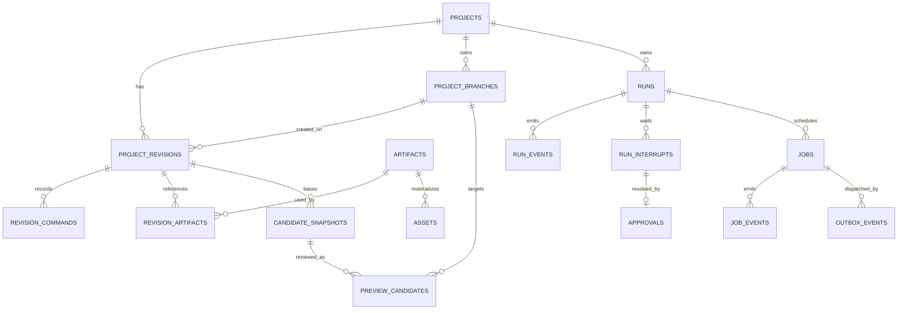
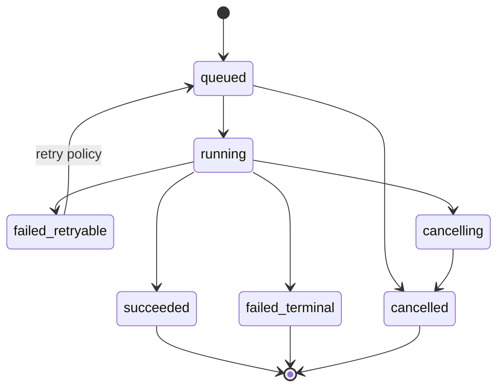

# Motif Forge 持久化与 Worker 规范

> 状态：首版数据与异步执行合同
> 数据库：PostgreSQL
> 队列：Celery + Redis
> Artifact：可配置、默认引导到外置卷的本地内容寻址仓库

## 1. 存储职责

| 系统 | 保存 | 不保存/不作为 |
|---|---|---|
| PostgreSQL | 项目、Revision、IR JSONB、命令、Run、Job、事件、审批、Artifact metadata、许可 | 大型音频二进制 |
| LangGraph Checkpointer/PostgreSQL | 单个 Run 的 compact state/checkpoint | 项目事实、完整 IR、Event history |
| Redis | Celery 投递、短期协调 | 业务事实、唯一 Job 状态 |
| Artifact Store | WAV/MP3/MIDI/peaks/analysis/manifest、可重建缓存 | 可变项目状态、未受控绝对路径 |
| Browser | draft、selection、AudioNode runtime | committed Revision |

## 2. PostgreSQL 逻辑 Schema

建议将业务表、LangGraph checkpointer 表和可观测性表分 Schema 管理：

- `app.*`
- `langgraph.*`
- `observability.*`（若本地保存）

不要让业务迁移修改 LangGraph 库管理的表。

## 3. 核心表

### 3.1 项目与 Revision

| 表 | 关键字段 |
|---|---|
| `projects` | id、name、active_branch_id、status、created/updated |
| `project_revisions` | id、project_id、created_on_branch_id、parent_id、arrangement_ir JSONB、hash、versions、source_run |
| `revision_commands` | revision_id、sequence、command_id/type/schema、payload JSONB |
| `revision_artifacts` | revision_id、artifact_id、role、track/range refs |
| `project_branches` | id、project_id、name、head_revision_id、base_revision_id、created/updated |
| `candidate_snapshots` | id、project_id、base_revision_id、source_run/candidate、candidate_ir JSONB、candidate_hash、command/materialization metadata、diff、lineage、created |
| `preview_candidates` | id、project_id、branch_id、base_revision_id、candidate_snapshot_id/hash、impact、expires/status、approved_revision_id |
| `approvals` | run/interrupt/checkpoint、decision、actor、payload hash、time |

`project_branches.head_revision_id` 是分支头的唯一权威指针。`projects.active_branch_id` 只选择当前工作分支；API 返回的 `current_revision_id` 由 active branch head 投影，不在 `projects` 中保存第二份可独立漂移的指针。

### 3.2 Run 与事件

| 表 | 关键字段 |
|---|---|
| `runs` | id、thread_id、project_id、target_branch_id、parent_run_id、run_type、base_revision、graph/state versions、phase/status |
| `run_events` | bigint event_id、run_id、sequence、event_type、payload/schema、trace、time |
| `run_interrupts` | id、run/checkpoint、kind、safe payload、status、expires |
| `usage_ledger` | operation_id、run/node/provider、tokens/cache/cost/render seconds |
| `error_records` | error envelope fields、protected detail ref |

`run_events.event_id` 是 SSE 重放游标；`(run_id, sequence)` 唯一。

### 3.3 Job、Outbox 与去重

| 表 | 关键字段 |
|---|---|
| `jobs` | id、type、run/thread/revision/candidate/segment、status、attempt、idempotency、deadline、heartbeat |
| `job_events` | id、job_id、event_type、progress、result/error refs、time |
| `outbox_events` | id、topic、aggregate id、payload ref、published_at、attempt |
| `inbox_receipts` | consumer、external_event_id、processed_at、result hash |

`jobs.idempotency_key` 在 Job 类型/输入 hash/engine version 范围内唯一。

### 3.4 Asset 与 Artifact

| 表 | 关键字段 |
|---|---|
| `artifacts` | id、sha256、media type、size、storage key、ingest status、lifecycle class、availability、producer、engine/version、lineage/recipe ref |
| `artifact_recipes` | artifact_id、recipe kind/schema/hash、ordered input refs/hashes、params、seed、engine/policy versions、expected media/validation |
| `assets` | id、primary artifact、catalog metadata、source、license、review status |
| `asset_previews` | asset_id、artifact_id、feature summary |
| `external_sound_results` | search id、provider key、metadata/license snapshot、status |
| `knowledge_packs` | id/name/version/status/manifest hash |
| `policy_versions` | name/version/content hash/effective time/status |

## 4. ER 关系



## 5. 事务边界

### 5.1 写命令/Revision

同一事务完成目标 Branch 锁、`branch_id + base_revision_id` 校验、Revision/Command/Audit/Run Event 插入与 Branch head 更新。若操作明确切换工作分支，同一事务更新 `projects.active_branch_id`。音频重渲染不在该事务中；事务写入 Job + Outbox，前端先看到 Revision 已提交、render state pending。

### 5.2 创建 Job

Graph/Application 在同一事务中：

1. 插入或按 idempotency key 获取 Job。
2. 插入 `job.queued` Run Event。
3. 插入 Outbox Event。
4. 提交。

Dispatcher 使用 `FOR UPDATE SKIP LOCKED` 批量领取未发布 Outbox；发布 Redis 后写 `published_at`。发布成功但数据库更新失败会造成重复投递，Worker 必须幂等。

### 5.3 Worker 完成

Worker 写 Artifact 文件成功后，在数据库事务中：

1. 校验 Job 仍允许完成，锁定 Job。
2. 注册或复用 checksum 相同 Artifact metadata。
3. 写 `job.completed`、Run Event 和 Graph resume Outbox。
4. 将 Job 置为 succeeded。
5. 提交。

Worker 不更新 Branch head，也不切换 Project active branch。

## 6. Job 状态机



状态只能前进；迟到 heartbeat 或 progress 不能把 terminal Job 改回 running。

## 7. Celery 规则

- Redis 只发送 `job_id` 和安全 routing metadata。
- Worker 启动任务后先从 PostgreSQL 读取请求、状态和 deadline。
- CPU/内存密集 Job 设置独立 queue：`ingest`、`analysis`、`render`、`export`。
- 首版本地可以运行一个 Worker 监听全部 queue；Render concurrency 默认 1。
- 对幂等任务使用 late acknowledgement/worker-lost 重投语义；最终是否执行仍由 DB Job 状态判断。
- Celery 自动 retry 只处理已指定的进程/瞬时错误，音乐验证和 Schema 错误交还 Graph。
- 每个任务发送 heartbeat；Reconciler 只重投超过 policy 阈值且无有效进程租约的 Job。

## 8. 取消与清理

- API 设置 Run/Job `cancel_requested_at`，Worker 在 Segment、解码、渲染阶段边界轮询。
- 不强杀正在原子写 Artifact 的临界区；完成写入后可将 Artifact 标记为 unreferenced。
- 取消不删除原始上传、已提交 Revision 或已被其他 Revision 引用的 Artifact。
- 临时文件放在 Artifact Root 内的 Job 专属目录，保证与最终内容寻址目标同文件系统；成功/失败后按 retention policy 清理，不得跟随 symlink/junction。

## 9. Artifact 写入协议

1. 根据 Job ID 创建受控临时目录。
2. 只读取数据库解析后的 Artifact ID，不接受请求路径。
3. 写临时文件，关闭句柄。
4. 校验 magic bytes、媒体属性、大小和 sha256。
5. 以内容 hash 计算目标 key。
6. 原子移动/复用已存在内容。
7. 注册 metadata 与 lineage。

Artifact Store key 不是对外 API；数据库记录逻辑 ID 与 content hash。

每个音频 Artifact 必须保存 `quality_profile_id`、codec、sample rate、channels、bit depth 或 bitrate、encoder/version。质量档位是 recipe 和 cache key 的组成部分，不能仅存在于文件扩展名或 Worker 参数中。`source-original.v1` 保存用户原始 bytes/checksum，不可被标准化或低码率副本覆盖。

### 9.1 Artifact Root 解析与可用性

- 使用单一配置键（例如 `MOTIF_FORGE_ARTIFACT_ROOT`）注入宿主机 Artifact Root；项目相对 `var/artifacts` 只是 portable/CI/test 的代码级回退，容器内只看到固定挂载点。配置、Compose、测试和文档不硬编码任何用户名、卷名或个人绝对路径。
- 本地 Lean Profile 首次配置默认引导用户从可写外置卷中选择 Root；必须显示目标卷、可用空间与预计用量并由用户确认，不自动选中未知磁盘。若选内置盘，必须显式确认后写入配置，而不是偷用 portable 回退。
- API/Worker 启动和每个大型 Job 前执行能力探测：Root 是预期目录、不是 symlink/reparse point、可写、临时区与最终区同文件系统、原子 rename 成功、写后 checksum 一致、剩余容量足够。
- Root 未挂载或探测失败时返回 `ARTIFACT_ROOT_UNAVAILABLE`，暂停新的 Upload/Render/Export；不静默改用内置盘，不因卷级不可用而把全库 Artifact 标记为 `missing`。
- PostgreSQL data volume、Redis 数据、容器 VM 和必需镜像留在内置盘；不把活数据库目录放到可移除或未经验证的外置文件系统。

### 9.2 Artifact 生命周期、TTL 与重建

`ingest_status`、`lifecycle_class` 和 `availability = available | evicted | missing | rehydrating` 是三个独立维度：

| lifecycle class | 例子 | 策略 |
|---|---|---|
| `protected` | 原始导入、当前 Revision 引用、待审批候选的必需输入 | 不可自动驱逐；引用变化后重新评估，不直接降级 |
| `durable` | 选中 Master、manifests、license/provenance、非可重建素材 | 无 TTL；仅显式用户删除/归档 |
| `rebuildable` | peaks、analysis、normalized/time-stretch、旧 Revision render cache、按需 Stem | 超过软配额时按 LRU/成本驱逐；必须有有效 recipe 与可用输入 |
| `ephemeral` | Job scratch、中断残留、已拒绝/未选候选压缩试听 | Job 终态后清理；需调试时最多保留 24 小时 |

待 HITL 的候选试听在等待期间视为 `protected`；拒绝、superseded 或选中其他候选后转为 `ephemeral`，默认 24 小时过期。未受保护的可重建派生缓存默认 7 天过期；终态 Run checkpoint 默认保留 7 天，它属于 PostgreSQL retention，不计为 Artifact bytes。

驱逐一个 `rebuildable` Artifact 时，数据库事务先锁定 metadata 并再次确认：无运行中 Job 租约、未被当前 Revision/待审 Preview 保护、recipe 完整、所有非可重建输入为 `available`。删除 bytes 成功后才设置 `availability=evicted`。重建通过新的幂等 Job 执行；创建/复用 Job 时原子设置 `rehydrating`，完成 checksum 校验后才设为 `available`，失败则根据 Error Policy 回到 `evicted` 以便重试，或在输入/完整性不可恢复时设为 `missing`。若 bytes 未预期不存在或 checksum 不匹配，设置 `missing`并发出 `ARTIFACT_MISSING`，不伪装成正常驱逐。

### 9.3 StoragePressureGate v1

`StoragePressureGate v1` 是 Upload、Candidate fan-out 试听、Render、Time-stretch 和 Export 之前的确定性 Rule Policy，`model: none`。

**输入事实**：Root capability probe、Root 可用 bytes、全局/项目当前用量与配额、输出估算 bytes、安全余量、输出角色、lifecycle/availability、TTL、引用和 Job 租约。估算必须按时长、采样率、bit depth、声道、轨数和 codec 最坏情况计算。

**顺序规则**：

1. `STO-001`：Root 未配置/未挂载/能力探测失败 → `wait_for_storage`，`ARTIFACT_ROOT_UNAVAILABLE`。
2. `STO-005`：依赖为 `missing` 或 recipe/输入不可恢复 → `fail`，`ARTIFACT_MISSING` 或 `ARTIFACT_REHYDRATION_FAILED`。
3. `STO-008`：依赖为 `evicted` → `rehydrate_then_resume`；已为 `rehydrating` 时复用原 Job 并等待，不重复创建。
4. `STO-010`：预计写入后仍满足安全余量、项目软配额、临时区硬配额和全局硬配额 → `proceed`。
5. `STO-020`：超过软配额但存在到期 `ephemeral` 或安全 `rebuildable` → `gc_then_retry`，记录干跑清单、实际释放 bytes 和 Artifact IDs；每个 operation 最多清理并重算一次。
6. `STO-030`：Preview 可使用完整时长 `candidate-preview.v1`，局部试听可使用 `audition-lite.v1`，或暂缓非必需 Stem，且不改变最终导出规格 → 先确定性改写输出计划、附 warnings，再按同一 operation 重新评估并最终 `proceed`；这不是第六条 Graph 路由。
7. `STO-040`：清理后仍超过硬配额/安全余量，或只能删除 `protected/durable` 才继续 → `wait_for_storage`，`STORAGE_QUOTA_EXCEEDED`，等待用户换 Root、增加配额或显式删除/归档。
8. `STO-050`：用户取消、deadline 到期或重评仍不可恢复 → `fail`，保留最近成功产物和恢复说明。

稳定输出只允许 `proceed | gc_then_retry | rehydrate_then_resume | wait_for_storage | fail`，与 Parent Graph 条件 Edge 一一对应。默认目标：Artifact Root 全局硬配额 10 GiB、单项目软配额 2 GiB、临时区硬配额 2 GiB，均可配置。清理不接受模型或客户端传入的路径/删除列表，只使用数据库中的 Artifact ID、服务端 storage key 和引用图。

### 9.4 MediaQualityProfile v1

| Profile | 用途 | 编码合同 | 生命周期默认值 |
|---|---|---|---|
| `source-original.v1` | 用户导入与许可来源 | 原始 bytes、原始 codec/channels；checksum 不变 | `protected` |
| `audition-lite.v1` | 素材浏览、Repair、局部验证 | 最多 15 秒、MP3 128 kbps、保留源声道 | `ephemeral`，最多 24h |
| `candidate-preview.v1` | A/B 完整候选 | 48 kHz stereo、MP3 160 kbps | HITL 时 `protected`，终态后 `ephemeral` 24h |
| `working-pcm.v1` | 编辑、分析、time-stretch、转码输入 | 48 kHz stereo、PCM16 WAV | `rebuildable`，默认 7d |
| `canonical-master.v1` | 最终选中 Master | 48 kHz stereo、PCM24 WAV | `durable` |
| `canonical-stem.v1` | 用户显式 Stem 导出 | 48 kHz stereo、PCM24 WAV | `durable` 或显式导出保留策略 |

低码率只用于可重建试听。编码失败不得静默下调码率；必须返回稳定错误并按 Error Policy 重试/回退到最近可播放 Artifact。waveform peaks 与 FeatureArtifact 是独立可重建 Artifact，不能把音频 base64 或完整波形塞进 PostgreSQL、Redis、事件或 Graph State。

本地 Lean Profile 的 checkout、Web dependencies、音色包、导入、试听、waveform、analysis、derived audio、export、音频 Eval fixture 与可迁移工具 cache 都位于外置盘；内置盘仅保留容器 VM、活跃数据库 Volume、必需镜像及无法在外置文件系统可靠运行的最小环境。所有 Job scratch 都必须位于 Artifact Root 内，确保原子提升且避免把中间 WAV 写入系统临时目录。

## 10. Chromium Render Worker

### 10.1 执行路径

```text
RenderJob
→ load pinned Revision/IR
→ verify asset checksums
→ Python ChromiumRenderAdapter acquires render slot
→ reuse/start pinned Playwright Chromium process
→ load fixed loopback render.html + pinned audio-engine bundle
→ pass RenderBridgeRequest (IR/ref, range, output mode, versions)
→ browser validates request and compiles AudioGraphSpec
→ Tone.Offline / OfflineAudioContext render
→ stream WAV bytes to one-time authenticated loopback sink
→ Python validates receipt, media properties and checksum
→ feature/peak/clipping validation
→ content-addressed Artifact
```

Celery Task 保持 Python 边界；TypeScript 音频引擎只运行在固定的 Chromium 页面中。`ChromiumRenderAdapter` 是两者唯一桥接点，不能在 Python 中复制一套 Tone 合成语义。渲染页面只绑定 `127.0.0.1`，不访问外网；输出 sink 的一次性 token 绑定 job/output role/字节上限，完成后失效。禁止把数十 MB WAV 作为 base64 塞进 Graph State、Redis 消息或 Playwright JSON 返回值。

`RenderBridgeRequest` 至少包含 `job_id`、`revision/candidate_snapshot_ref`、`range`、`output_role`、`sample_rate`、`seed`、`audio_engine_version`、`tone_version`、`chromium_revision`、Asset refs/checksums 和 cancel token。`RenderBridgeReceipt` 只返回状态、帧数、声道、时长、warnings、sink receipt 与安全错误码；Artifact metadata 仍由 Python Worker 校验并写库。

浏览器进程允许复用，但 Page/AudioContext 按 Job 重新创建。取消先触发页面 AbortSignal；超时关闭 Job Page，只有进程失去响应时才重启受控 Chromium。每个 Job 设置 wall-clock、内存、输出时长、无进展 timeout 和最大输出字节数。

### 10.2 性能策略

- 默认 `render` queue concurrency = 1。
- 两个候选结构可并行，音频渲染默认顺序执行。
- Repair Loop 优先渲最多 15 秒或选区的 `audition-lite.v1`；进入 A/B 时两个候选各渲完整时长 `candidate-preview.v1`，不预生成它们的 Master WAV 和全部 Stem。
- 候选被选中后按需生成 48 kHz/24-bit canonical Master WAV；逐轨 WAV 只在 Stem 导出请求时渲染，导出包交付后内部临时 Stem 可进入 retention policy。
- 重渲只针对受影响 Track/range；最终导出再完整渲染。
- Chromium 冷启动、资源峰值、5 分钟/12 轨 P95 纳入 Eval。
- 如果资源不足，返回 `RENDER_RESOURCE_EXHAUSTED` 和最近成功 Preview，不允许静默换渲染器。
- Worker 的 pinned Chromium 是 canonical render；浏览器实时 Preview 只要求在版本化特征/听感容差内保持语义一致，不承诺不同平台逐字节相同。
- canonical cache key 至少包含 IR/candidate hash、range/output role、Asset checksums、sample rate、seed、audio-engine/Tone/Chromium versions 与 Render Policy version。

### 10.3 开发前 Render Spike

正式实现渲染队列前必须完成一个 30 秒代表工程 Spike：Synth + Sampler + EQ + Reverb，验证 Master 和至少两个 Stem。Spike 必须记录冷/热启动、进程复用、峰值内存、取消/超时、重复 Job 缓存、Master/Stem 串音，以及浏览器 Preview 与 canonical Worker 的特征容差。未通过时先调整 Render Policy 或桥接协议，不继续堆叠 Agent 功能。

2026-08-11 的第一轮 Spike 已完成共享 `AudioGraphSpec v1`、Tone Offline 编译、三个内置 Synth Preset、内置无版权 click sample、EQ、pan/gain、固定种子 convolution reverb、Master 与两条 Stem、一次性 loopback sink、输出字节上限和超时关闭。最新代表工程在固定 Chromium 151、2 CPU/1 GiB/无外网容器中，30 秒 48 kHz stereo 单次离线渲染约 1.51–2.45 秒，进程聚合 RSS 峰值约 863 MB；四次渲染复用一个浏览器。重复 Master 的 288 万个 PCM16 样本中 49 个处于 1 LSB 量化边界，最大差异 1 LSB、比例约 0.0017014%，因此验收使用版本化样本容差并同时保留 checksum，不宣称字节完全相同。Worker 镜像只包含 pinned Node、Chromium headless shell、浏览器依赖与运行时 JS；FFmpeg 不重复塞入 Chromium 镜像。

该结果只通过 30 秒代表性 Gate，不替代 1/3/5 分钟、4/8/12 轨矩阵。Alembic `20260811_0004` 已落地 Run/Job/RunEvent/JobEvent/Outbox/Inbox 与 Artifact media/quality metadata，`20260811_0005` 补充 Job deadline/max-attempt/lease/heartbeat/progress 与 Outbox available-at/lease/error，`20260812_0006/0007/0008` 继续加入 Upload、导入分析和完整 rebuild/lifecycle/storage event 合同，`20260812_0009` 新增独立 `feature_artifacts` 及 Job 的 feature output profile。Job Dispatcher 已使用 `FOR UPDATE SKIP LOCKED` 领取，Redis/Celery 只传 Job ID，Media Worker 使用 late ack、单预取、并发 1 和 PostgreSQL 幂等完成事务；Resume Dispatcher 已独立常驻，只领取 payload 中 `run_type=parent.*` 的 `graph.resume.requested`，并用 `resume_event_id` 对终态 checkpoint 重放去重。受控 Upload、working PCM、time-stretch、waveform/analysis Feature Artifact 与它们的显式 rehydrate 已实现；浏览器 Preview A/B 特征比较、取消 API、通用 render/transcode 重建与完整媒体 Artifact 下载校验尚未实现。默认 `render` concurrency 继续保持 1。

`feature_artifacts` 与音频 `artifacts` 分表，唯一键至少覆盖 source Audio Artifact + Feature Profile，并保留 source hash、schema version、recipe/hash、storage key、四态可用性和访问/驱逐/恢复时间。Ingest Worker 在同一完成事务中登记 normalized Audio Artifact 以及 waveform/analysis Feature Artifacts；任一数据库写失败都不能提交半套可发现结果。Feature 恢复 Job 只输出一个明确 `output_feature_profile`，与音频 `output_quality_profile` 严格 XOR。

## 11. Time-stretch Worker

- 输入是 immutable Audio Artifact、source/target BPM、ratio、range、engine version。
- 首版使用 FFmpeg `atempo` 组合满足受支持 ratio，并保留音高。
- 输出新的 Derived WAV Artifact；原件不可覆盖。
- 完成后验证 duration/BPM、chroma/pitch deviation、loudness、silence、click/pop。
- 相同 input hash + ratio + quality + engine version 命中缓存。
- Derived Artifact 未就绪前 UI 播放原始速度，不提供变调的伪预览。

当前已实现独立、路径受控的 `time-stretch-recipe.v1` 运算器：输入仅接受 Artifact/Job ID 与 source/target BPM，支持 0.5x–2.0x，调用 FFmpeg `atempo` 输出 48 kHz stereo PCM16，保留不可变原件，并以 checksum 原子提升到 Derived namespace。质量门已用真实 440 Hz WAV 验证时长和 ±25 cents 音高容差，并检查 silence、peak、click risk 与相同 recipe 内容复现。持久 Time-stretch Job 已由真实 Outbox → Redis/Celery → 非 root Media Worker 调用，完成事件原子写回 Artifact/Job/Run/Inbox/Resume Outbox；重复投递不会重复增加 attempt 或创建第二份逻辑 Artifact。`motif-forge-parent.v1` 已正式挂接这一分支，Resume Dispatcher 可在连接关闭后恢复同一 checkpoint，并对相同 `resume_event_id` 幂等确认；API 继续禁止任意文件路径，导入/上传和 Arrangement 物化尚未公开。

## 12. 外部音色导入

外部 Connector 只写 `external_sound_results`。用户确认后创建 Download/Ingest Job，执行：

- Provider allowlist 和 URL host 校验。
- 许可证快照、creator、attribution 保存。
- 大小/时长/格式限制。
- Quarantine、checksum、decode、preview。
- 通过审核后才创建 Asset。

下载 Worker 不接收模型生成的任意 URL。

## 13. LangGraph Checkpointer

- 使用 PostgreSQL Async Checkpointer，存放在独立 Schema。
- thread ID 与 Run 一一对应；Run 表保存 thread ID 和 Graph 版本。
- Checkpoint 只存 compact State 和 refs。
- Run terminal 后默认保留可调试 checkpoint 7 天，可配置；Project 读取不依赖 checkpoint。
- checkpoint 加密密钥与应用 Secret 分开管理；不得使用 pickle fallback 保存不可信对象。

## 14. 恢复场景

| 场景 | 恢复 |
|---|---|
| API 在事务提交前崩溃 | 无业务写入，客户端同 key 重试 |
| Job/Outbox 已提交但未发布 | Dispatcher 后续发布 |
| Redis 重复投递 | Worker DB 状态/idempotency 去重 |
| Worker 写文件后 DB 崩溃 | 下次按 checksum 复用或清理孤儿 |
| Job 完成事件重复 | inbox receipt + event unique key 去重 |
| Graph resume 前服务重启 | Resume Outbox 重新派发 |
| HITL 等待数日 | PostgreSQL checkpoint + interrupt 恢复 |
| Branch head 在 Preview 等待时被编辑 | 审批 409，PreviewCandidate superseded |
| Artifact Root 拔出/未挂载 | 暂停新 Job并返回 `ARTIFACT_ROOT_UNAVAILABLE`；不静默回落、不批量标记 missing |
| Rebuildable Artifact 已驱逐 | 从 recipe/lineage 创建幂等重建 Job，availability 转为 `rehydrating`；前端显示 rebuilding |
| Artifact bytes 非预期丢失/checksum 错误 | 标记 `missing`，停止依赖路径并返回 `ARTIFACT_MISSING` |

## 15. 迁移、备份与测试

- Alembic 迁移必须包含 upgrade/downgrade 或明确不可逆说明。
- Integration Test 使用真实 PostgreSQL/Redis 容器，不以 SQLite 替代。
- 备份至少覆盖 PostgreSQL 与 Artifact manifest；恢复后验证 checksum 和 Revision refs。
- Failure injection 覆盖 Outbox 重复、Worker crash、迟到事件、Artifact mismatch、Redis 重启和 checkpoint 版本不兼容。
- Artifact 测试还必须覆盖：Root 启动未挂载/运行中拔出、原子 rename 探测失败、软/硬配额边界、保护引用不被清理、TTL、安全驱逐→重建、missing 与 evicted 不混淆、cleanup 幂等和 symlink 拒绝。
- 上线 Lean Storage 前必须用 Alembic 增加 lifecycle/availability/recipe 字段或表，并对旧 Artifact 做 bytes/checksum 探测后再 backfill；不在应用启动时隐式改表。
