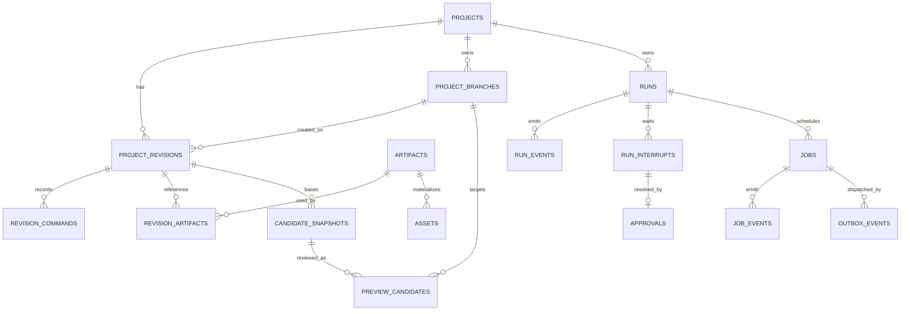
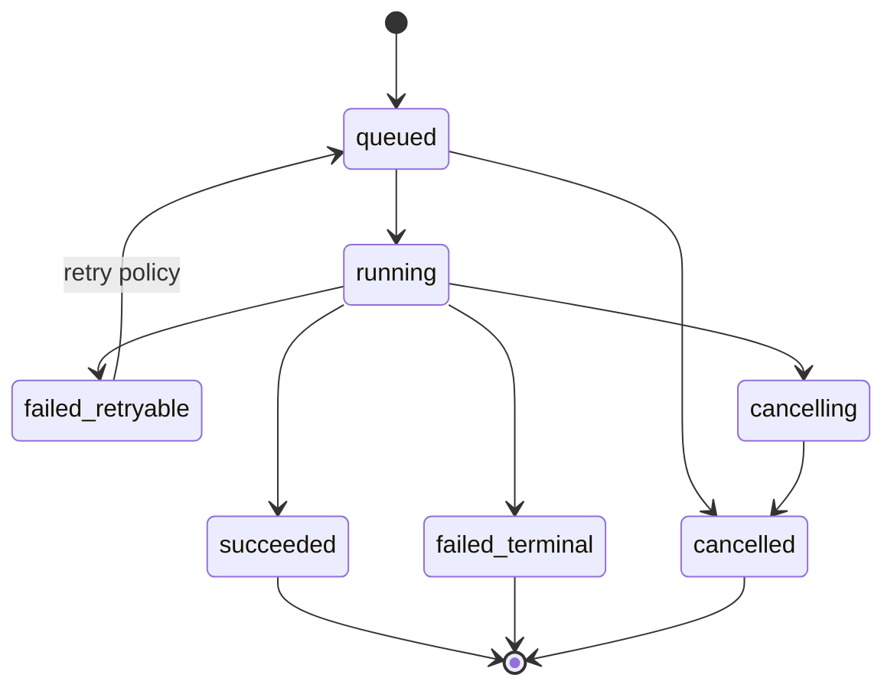

# Motif Forge 持久化与 Worker 规范

> 状态：首版数据与异步执行合同
> 数据库：PostgreSQL
> 队列：Celery + Redis
> Artifact：本地内容寻址仓库

## 1. 存储职责

| 系统 | 保存 | 不保存/不作为 |
|---|---|---|
| PostgreSQL | 项目、Revision、IR JSONB、命令、Run、Job、事件、审批、Artifact metadata、许可 | 大型音频二进制 |
| LangGraph Checkpointer/PostgreSQL | 单个 Run 的 compact state/checkpoint | 项目事实、完整 IR、Event history |
| Redis | Celery 投递、短期协调 | 业务事实、唯一 Job 状态 |
| Artifact Store | WAV/MP3/MIDI/peaks/analysis/manifest | 可变项目状态 |
| Browser | draft、selection、AudioNode runtime | committed Revision |

## 2. PostgreSQL 逻辑 Schema

建议将业务表、LangGraph checkpointer 表和可观测性表分 Schema 管理：

- `app.*`
- `langgraph.*`
- `observability.*`（若本地保存）

不要让业务迁移修改 LangGraph 库管理的表。

## 3. 核心表

### 3.1 项目与 Revision

| 表 | 关键字段 |
|---|---|
| `projects` | id、name、active_branch_id、status、created/updated |
| `project_revisions` | id、project_id、created_on_branch_id、parent_id、arrangement_ir JSONB、hash、versions、source_run |
| `revision_commands` | revision_id、sequence、command_id/type/schema、payload JSONB |
| `revision_artifacts` | revision_id、artifact_id、role、track/range refs |
| `project_branches` | id、project_id、name、head_revision_id、base_revision_id、created/updated |
| `candidate_snapshots` | id、project_id、base_revision_id、source_run/candidate、candidate_ir JSONB、candidate_hash、command/materialization metadata、diff、lineage、created |
| `preview_candidates` | id、project_id、branch_id、base_revision_id、candidate_snapshot_id/hash、impact、expires/status、approved_revision_id |
| `approvals` | run/interrupt/checkpoint、decision、actor、payload hash、time |

`project_branches.head_revision_id` 是分支头的唯一权威指针。`projects.active_branch_id` 只选择当前工作分支；API 返回的 `current_revision_id` 由 active branch head 投影，不在 `projects` 中保存第二份可独立漂移的指针。

### 3.2 Run 与事件

| 表 | 关键字段 |
|---|---|
| `runs` | id、thread_id、project_id、target_branch_id、parent_run_id、run_type、base_revision、graph/state versions、phase/status |
| `run_events` | bigint event_id、run_id、sequence、event_type、payload/schema、trace、time |
| `run_interrupts` | id、run/checkpoint、kind、safe payload、status、expires |
| `usage_ledger` | operation_id、run/node/provider、tokens/cache/cost/render seconds |
| `error_records` | error envelope fields、protected detail ref |

`run_events.event_id` 是 SSE 重放游标；`(run_id, sequence)` 唯一。

### 3.3 Job、Outbox 与去重

| 表 | 关键字段 |
|---|---|
| `jobs` | id、type、run/thread/revision/candidate/segment、status、attempt、idempotency、deadline、heartbeat |
| `job_events` | id、job_id、event_type、progress、result/error refs、time |
| `outbox_events` | id、topic、aggregate id、payload ref、published_at、attempt |
| `inbox_receipts` | consumer、external_event_id、processed_at、result hash |

`jobs.idempotency_key` 在 Job 类型/输入 hash/engine version 范围内唯一。

### 3.4 Asset 与 Artifact

| 表 | 关键字段 |
|---|---|
| `artifacts` | id、sha256、media type、size、storage key、status、producer、engine/version、lineage |
| `assets` | id、primary artifact、catalog metadata、source、license、review status |
| `asset_previews` | asset_id、artifact_id、feature summary |
| `external_sound_results` | search id、provider key、metadata/license snapshot、status |
| `knowledge_packs` | id/name/version/status/manifest hash |
| `policy_versions` | name/version/content hash/effective time/status |

## 4. ER 关系



## 5. 事务边界

### 5.1 写命令/Revision

同一事务完成目标 Branch 锁、`branch_id + base_revision_id` 校验、Revision/Command/Audit/Run Event 插入与 Branch head 更新。若操作明确切换工作分支，同一事务更新 `projects.active_branch_id`。音频重渲染不在该事务中；事务写入 Job + Outbox，前端先看到 Revision 已提交、render state pending。

### 5.2 创建 Job

Graph/Application 在同一事务中：

1. 插入或按 idempotency key 获取 Job。
2. 插入 `job.queued` Run Event。
3. 插入 Outbox Event。
4. 提交。

Dispatcher 使用 `FOR UPDATE SKIP LOCKED` 批量领取未发布 Outbox；发布 Redis 后写 `published_at`。发布成功但数据库更新失败会造成重复投递，Worker 必须幂等。

### 5.3 Worker 完成

Worker 写 Artifact 文件成功后，在数据库事务中：

1. 校验 Job 仍允许完成，锁定 Job。
2. 注册或复用 checksum 相同 Artifact metadata。
3. 写 `job.completed`、Run Event 和 Graph resume Outbox。
4. 将 Job 置为 succeeded。
5. 提交。

Worker 不更新 Branch head，也不切换 Project active branch。

## 6. Job 状态机



状态只能前进；迟到 heartbeat 或 progress 不能把 terminal Job 改回 running。

## 7. Celery 规则

- Redis 只发送 `job_id` 和安全 routing metadata。
- Worker 启动任务后先从 PostgreSQL 读取请求、状态和 deadline。
- CPU/内存密集 Job 设置独立 queue：`ingest`、`analysis`、`render`、`export`。
- 首版本地可以运行一个 Worker 监听全部 queue；Render concurrency 默认 1。
- 对幂等任务使用 late acknowledgement/worker-lost 重投语义；最终是否执行仍由 DB Job 状态判断。
- Celery 自动 retry 只处理已指定的进程/瞬时错误，音乐验证和 Schema 错误交还 Graph。
- 每个任务发送 heartbeat；Reconciler 只重投超过 policy 阈值且无有效进程租约的 Job。

## 8. 取消与清理

- API 设置 Run/Job `cancel_requested_at`，Worker 在 Segment、解码、渲染阶段边界轮询。
- 不强杀正在原子写 Artifact 的临界区；完成写入后可将 Artifact 标记为 unreferenced。
- 取消不删除原始上传、已提交 Revision 或已被其他 Revision 引用的 Artifact。
- 临时文件放在 Job 专属目录，成功/失败后按 retention policy 清理；不得跟随 symlink/junction。

## 9. Artifact 写入协议

1. 根据 Job ID 创建受控临时目录。
2. 只读取数据库解析后的 Artifact ID，不接受请求路径。
3. 写临时文件，关闭句柄。
4. 校验 magic bytes、媒体属性、大小和 sha256。
5. 以内容 hash 计算目标 key。
6. 原子移动/复用已存在内容。
7. 注册 metadata 与 lineage。

Artifact Store key 不是对外 API；数据库记录逻辑 ID 与 content hash。

## 10. Chromium Render Worker

### 10.1 执行路径

```text
RenderJob
→ load pinned Revision/IR
→ verify asset checksums
→ Python ChromiumRenderAdapter acquires render slot
→ reuse/start pinned Playwright Chromium process
→ load fixed loopback render.html + pinned audio-engine bundle
→ pass RenderBridgeRequest (IR/ref, range, output mode, versions)
→ browser validates request and compiles AudioGraphSpec
→ Tone.Offline / OfflineAudioContext render
→ stream WAV bytes to one-time authenticated loopback sink
→ Python validates receipt, media properties and checksum
→ feature/peak/clipping validation
→ content-addressed Artifact
```

Celery Task 保持 Python 边界；TypeScript 音频引擎只运行在固定的 Chromium 页面中。`ChromiumRenderAdapter` 是两者唯一桥接点，不能在 Python 中复制一套 Tone 合成语义。渲染页面只绑定 `127.0.0.1`，不访问外网；输出 sink 的一次性 token 绑定 job/output role/字节上限，完成后失效。禁止把数十 MB WAV 作为 base64 塞进 Graph State、Redis 消息或 Playwright JSON 返回值。

`RenderBridgeRequest` 至少包含 `job_id`、`revision/candidate_snapshot_ref`、`range`、`output_role`、`sample_rate`、`seed`、`audio_engine_version`、`tone_version`、`chromium_revision`、Asset refs/checksums 和 cancel token。`RenderBridgeReceipt` 只返回状态、帧数、声道、时长、warnings、sink receipt 与安全错误码；Artifact metadata 仍由 Python Worker 校验并写库。

浏览器进程允许复用，但 Page/AudioContext 按 Job 重新创建。取消先触发页面 AbortSignal；超时关闭 Job Page，只有进程失去响应时才重启受控 Chromium。每个 Job 设置 wall-clock、内存、输出时长、无进展 timeout 和最大输出字节数。

### 10.2 性能策略

- 默认 `render` queue concurrency = 1。
- 两个候选结构可并行，音频渲染默认顺序执行。
- 可先渲 10–20 秒或选区 Preview；完整 Master 在用户需要或进入 A/B 前渲染。
- 重渲只针对受影响 Track/range；最终导出再完整渲染。
- Chromium 冷启动、资源峰值、5 分钟/12 轨 P95 纳入 Eval。
- 如果资源不足，返回 `RENDER_RESOURCE_EXHAUSTED` 和最近成功 Preview，不允许静默换渲染器。
- Worker 的 pinned Chromium 是 canonical render；浏览器实时 Preview 只要求在版本化特征/听感容差内保持语义一致，不承诺不同平台逐字节相同。
- canonical cache key 至少包含 IR/candidate hash、range/output role、Asset checksums、sample rate、seed、audio-engine/Tone/Chromium versions 与 Render Policy version。

### 10.3 开发前 Render Spike

正式实现渲染队列前必须完成一个 30 秒代表工程 Spike：Synth + Sampler + EQ + Reverb，验证 Master 和至少两个 Stem。Spike 必须记录冷/热启动、进程复用、峰值内存、取消/超时、重复 Job 缓存、Master/Stem 串音，以及浏览器 Preview 与 canonical Worker 的特征容差。未通过时先调整 Render Policy 或桥接协议，不继续堆叠 Agent 功能。

## 11. Time-stretch Worker

- 输入是 immutable Audio Artifact、source/target BPM、ratio、range、engine version。
- 首版使用 FFmpeg `atempo` 组合满足受支持 ratio，并保留音高。
- 输出新的 Derived WAV Artifact；原件不可覆盖。
- 完成后验证 duration/BPM、chroma/pitch deviation、loudness、silence、click/pop。
- 相同 input hash + ratio + quality + engine version 命中缓存。
- Derived Artifact 未就绪前 UI 播放原始速度，不提供变调的伪预览。

## 12. 外部音色导入

外部 Connector 只写 `external_sound_results`。用户确认后创建 Download/Ingest Job，执行：

- Provider allowlist 和 URL host 校验。
- 许可证快照、creator、attribution 保存。
- 大小/时长/格式限制。
- Quarantine、checksum、decode、preview。
- 通过审核后才创建 Asset。

下载 Worker 不接收模型生成的任意 URL。

## 13. LangGraph Checkpointer

- 使用 PostgreSQL Async Checkpointer，存放在独立 Schema。
- thread ID 与 Run 一一对应；Run 表保存 thread ID 和 Graph 版本。
- Checkpoint 只存 compact State 和 refs。
- Run terminal 后按 retention policy 保留可调试 checkpoint；Project 读取不依赖 checkpoint。
- checkpoint 加密密钥与应用 Secret 分开管理；不得使用 pickle fallback 保存不可信对象。

## 14. 恢复场景

| 场景 | 恢复 |
|---|---|
| API 在事务提交前崩溃 | 无业务写入，客户端同 key 重试 |
| Job/Outbox 已提交但未发布 | Dispatcher 后续发布 |
| Redis 重复投递 | Worker DB 状态/idempotency 去重 |
| Worker 写文件后 DB 崩溃 | 下次按 checksum 复用或清理孤儿 |
| Job 完成事件重复 | inbox receipt + event unique key 去重 |
| Graph resume 前服务重启 | Resume Outbox 重新派发 |
| HITL 等待数日 | PostgreSQL checkpoint + interrupt 恢复 |
| Branch head 在 Preview 等待时被编辑 | 审批 409，PreviewCandidate superseded |

## 15. 迁移、备份与测试

- Alembic 迁移必须包含 upgrade/downgrade 或明确不可逆说明。
- Integration Test 使用真实 PostgreSQL/Redis 容器，不以 SQLite 替代。
- 备份至少覆盖 PostgreSQL 与 Artifact manifest；恢复后验证 checksum 和 Revision refs。
- Failure injection 覆盖 Outbox 重复、Worker crash、迟到事件、Artifact mismatch、Redis 重启和 checkpoint 版本不兼容。
