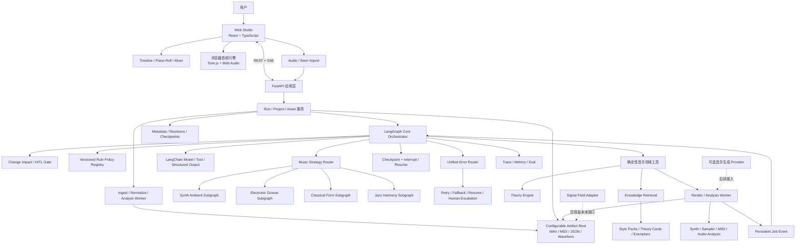
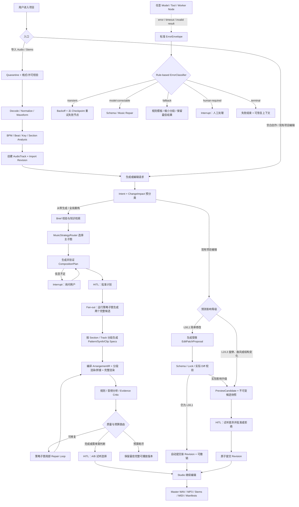

# Motif Forge 项目总指南

> 产品工作名：**Motif Forge**（音乐动机锻造台）
> 文档状态：**架构基线已批准，详细合同已拆分**
> 当前阶段：**G0、S1、S2、S3 已完成，S4 是唯一活动门**。浏览器已接通 Project Home、Brief、Plan Review/Approval、immutable child Replan、持久进度、完整导出、只读 Arrangement Studio、真实 MP3 播放和同一 Project 多 Stem；统一 Parent Graph v2、费用/恢复和不可变 Revision 合同保持不变。下一步实现四个版本化 Style Pack 与 Theory Engine；双候选/Repair、完整 DAW 和 AI 选区编辑仍按 S5–S7 顺序推进。当前事实与精确路线分别见 `IMPLEMENTATION_STATUS.md` 和 `NEXT_DEVELOPMENT_ROADMAP.md`。

---

## 0. 文档地图与优先级

本文件是产品范围、总体架构、学习顺序和验收目标的总览。代码级合同按以下文档执行：

1. [DECISION_LOG.md](./DECISION_LOG.md)：已批准且不能被实现静默推翻的架构决策。
2. [ARCHITECTURE_SPEC.md](./ARCHITECTURE_SPEC.md)：代码布局、依赖方向和端到端调用关系。
3. [DOMAIN_AND_REVISION_MODEL.md](./DOMAIN_AND_REVISION_MODEL.md)：ArrangementIR、Command、Revision、ChangeImpact 和 Artifact。
4. [API_AND_EVENT_CONTRACT.md](./API_AND_EVENT_CONTRACT.md)：REST、SSE、幂等、冲突和内部 Job 边界。
5. [AGENT_GRAPH_SPEC.md](./AGENT_GRAPH_SPEC.md)：Graph State、Node、Edge、Reducer、HITL 与错误路由。
6. [PERSISTENCE_AND_WORKER_SPEC.md](./PERSISTENCE_AND_WORKER_SPEC.md)：PostgreSQL、Celery、Redis、Outbox 和 Worker。
7. [FRONTEND_UX_SPEC.md](./FRONTEND_UX_SPEC.md)：前端状态、Canvas/DOM、音频运行时与视觉语言。
8. [IMPLEMENTATION_STATUS.md](./IMPLEMENTATION_STATUS.md)：当前代码事实、验收证据、技术债与开发断点。
9. [NEXT_DEVELOPMENT_ROADMAP.md](./NEXT_DEVELOPMENT_ROADMAP.md)：从当前断点到首版的依赖顺序和阶段门。

冲突时优先级为：已批准 Decision Log → 专项合同 → 本总指南。任何公共 Schema 变更仍需同步更新相关文档和迁移说明。

---

## 1. 项目结论

这是一个本地优先、网页形态、只生成**纯器乐**的 AI 编曲与音乐合成工作台。它不是“输入一句话，调用接口返回 MP3”的包装，也不试图第一版复制完整 DAW。

项目的核心差异化是：

1. LLM 理解审美意图、检索音乐知识、规划曲式与编配，并提出有边界的编辑操作。
2. 确定性的音乐工具把计划编译成可验证、可编辑、可回放的多轨乐曲结构。
3. Web Audio、合成器和合法采样负责真实发声、播放与导出。
4. LangGraph 管理长流程、并行候选、失败恢复、版本修订、预算和人工审批。
5. 用户可以像使用轻量 DAW 一样移动、裁切、拆分和调整音轨，也可以选中一个区域，让 AI 续写、替换、配器或增加伴奏。

一句话定位：

> **一个由 Agent 辅助创作、但由结构化乐曲状态和确定性音频引擎保证可执行性的纯器乐工作台。**

### 1.1 为什么不让普通大模型直接“生成 MP3”

聊天模型适合生成结构、约束、解释和工具决策，不适合作为低延迟音频时钟，也不能稳定地产出可裁切、可修改单个音符、可复现的波形。端到端音乐模型虽然能够生成音频，但通常更像不可透明编辑的 Audio Clip。

因此首版采用 **Symbolic-first + Sample/Synth 混合渲染**：

- Agent 输出曲式、和声、节奏、轨道角色、PatternSpec 和 EditPatchProposal。
- 领域工具把这些高层结构编译为精确的 NoteEvent、Clip 和 Automation。
- Tone.js/Web Audio 使用合成器与经过许可审核的采样播放和离线渲染。
- 将来接入 ACE-Step 等音频生成模型时，只把结果作为 `GeneratedAudioClip` 或 texture stem，不替代核心的可编辑乐曲结构。

这使项目同时具备真实用途与面试辨识度：创作结果可以听、可以改、可以解释、可以重放、可以评测，而不只是一次模型调用。

---

## 2. 产品目标、用户与边界

### 2.1 目标用户

- 有音乐想法但不熟悉专业 DAW 的开发者或内容创作者。
- 想快速制作游戏、视频、播客或个人作品背景音乐的人。
- 会做基础编曲，希望用 AI 快速探索结构、伴奏和变体的用户。
- 项目作者本人：以完整工程项目学习和展示 Agent、音频、前后端、可观测性和评测能力。

### 2.2 核心任务

用户应能完成以下任务：

1. 从空白项目开始，或导入一段已有音频/多条 Stem 作为参考、底轨或继续编曲的基础。
2. 用自然语言描述用途、时长、风格、情绪和禁用项，让 Agent 生成整曲、指定音轨或选区内容。
3. 在生成前查看并修改曲式、速度、调式、配器和能量曲线。
4. 在多轨时间线上拖动、裁切、分割、复制、循环和调节 Clip。
5. 选中已有音频前后的上下文，要求 AI “延续八小节”“增加低音轨”“把这里改得更克制”或“保留旋律，重写伴奏”。
6. 简单 AI 修改校验后直接形成可撤销版本；旋律、曲风、曲式或大范围变化展示差异并由用户接受、拒绝或创建分支。
7. 导出完整成曲的 WAV、MP3、逐轨 Stem、MIDI、项目清单、素材许可清单和生成轨迹摘要。

### 2.3 第一版硬边界

- 单机、单用户、本地项目。
- 纯器乐，不生成歌词、人声，不做声音克隆。
- 首版必须完成从 Brief 到完整成曲的闭环，而不是只生成短片段：支持 1–5 分钟、最多 12 条轨道、具有开端—发展—收束的完整结构，每次最多 2 个完整候选。
- 固定全局 BPM；先支持 4/4，可再加入 3/4。
- 首批四套知识包同时交付：`Synth Ambient`、`Minimal Electronic`、`Classical Chamber`、`Jazz Harmony & Improvisation`。
- 一个明确的推理模型：DeepSeek V4 Flash；保留 Provider 接口，但不把“支持多模型”当首版目标。
- 支持导入 WAV、MP3、FLAC；单个混音文件作为一条 Audio Track，多文件 Stem 可分别导入多轨。首版不自动做 stem separation。
- 默认内置 0.5–1 GiB 的 `Core Sound Palette Lite`，覆盖电子/合成器、基础鼓组、键盘/贝斯、弦乐室内乐和基础爵士管乐的紧凑音色；高采样层 multisample 作为可选 HQ Pack，所有 Sample/SoundFont/Preset 都有明确许可。
- DeepSeek 可以生成受约束的合成器音色、旋律和伴奏，也可以把自然语言音色描述转换成检索条件，从本地或许可 Allowlist 音源中寻找候选。
- 基础钢琴卷帘、多轨时间线、混音与效果；不追求专业 DAW 的全部能力。
- 首版具备 Master WAV、MP3、逐轨 Stem、MIDI、可继续编辑的项目文件、credits/license manifest 和 trace manifest 的完整导出能力；Master WAV 与 Stem 按需渲染，不为每个候选预先永久保存。

### 2.4 明确不做

- 不做普通“文本转音乐 API”套壳。
- 不做完整 Ableton/Logic 替代品。
- 不做录音、VST 插件宿主、自动 stem separation、自动修音、实时协作和云端素材市场。
- 首版提供受限的离线 pitch-preserving time-stretch，用于把导入音频对齐项目 BPM；不做专业 DAW 的实时弹性音频、复杂 tempo map 或极端拉伸。
- 不在线抓取“经典录音片段”作为样本。
- 不按在世艺术家的名字做精准模仿。
- 不把大模型的主观自评当作音质或音乐正确性的唯一依据。

---

## 3. 系统设计原则

### 3.1 项目状态是唯一事实源

波形、Tone.js 节点和页面组件都只是 `ArrangementIR` 的视图或运行时投影。项目版本只保存领域状态、命令记录与外部 Artifact 引用，不序列化浏览器音频对象。

### 3.2 Agent 只能提出受限 Patch

AI 不直接修改 Web Audio 节点、不写任意文件、不覆盖整个工程。它输出带 `base_revision_id` 和选区范围的 `EditPatchProposal`。服务端模拟 Patch，完成版本、Schema、锁定范围、许可和实际 ChangeImpact 检查：L0/L1 原子提交可撤销 Revision，L2/L3 创建 Preview 并经用户批准后提交。

### 3.3 模糊判断与确定性执行分离

Agent 负责审美意图、结构规划、风格选择和基于证据的诊断。时间换算、音符范围、量化、文件路径、素材许可、渲染、混音参数、预算与事务由普通代码完成。

### 3.4 音乐时间不用浮点秒作为主坐标

内部统一使用 PPQ tick（建议 480）表示乐谱事件；界面转换成小节、拍或秒。Audio Clip 的源文件 offset 仍使用秒。这样 tempo、量化、和声段落和 MIDI 导出具有一致语义。

### 3.5 所有创作步骤可追溯

计划、知识来源、Prompt、模型、Schema、素材、渲染引擎、随机种子、评测和人工决策全部带版本。失败案例可复现，候选可比较，最终作品可说明来源。

### 3.6 完整保留“事实与配方”，按需保留大型派生文件

首版默认使用 `Lean Storage Profile`：Revision、CandidateSnapshot、CompositionPlan、MIDI/项目 manifest、Artifact metadata、recipe、lineage、license 和 provenance 是可复现的事实；waveform、分析、标准化/拉伸派生文件、候选试听、旧渲染和 Stem 是可治理的大型产物。驱逐只能由确定性规则发生，不能破坏当前 Revision、原始导入、人工审批或最终导出能力。

音频质量使用版本化 `MediaQualityProfile`，不允许各节点临时决定码率：素材快速试听为 `audition-lite.v1`（最多 15 秒、MP3 128 kbps、保留源声道）；A/B 完整试听为 `candidate-preview.v1`（48 kHz stereo、MP3 160 kbps）；编辑、分析、time-stretch 和转码的工作中间件为 `working-pcm.v1`（48 kHz stereo PCM16 WAV）；最终选中 Master 为 `canonical-master.v1`（48 kHz stereo PCM24 WAV），Stem 只在显式导出时使用同规格生成。用户原始导入 `source-original.v1` 按原始 bytes/checksum 不可变保存，绝不以低质量副本覆盖。质量档位、codec、采样率、声道、bit depth/bitrate、编码器和版本都进入 Artifact metadata、recipe、cache key 与 trace。

---

## 4. 总体架构

### 4.1 前端职责

- 项目、计划、候选、时间线和审计信息的可视化。
- 本地低延迟试听与基本离线渲染。
- 将人工操作转换为同一套领域命令，以支持 undo、redo、replay 和 eval。
- 展示 AI Patch 的目标范围、依据、ChangeImpact 和结果；L0/L1 提供 Undo，L2/L3 提供预览、批准、拒绝和分支。
- 不保存 API Key，不把页面状态当最终项目状态。

### 4.2 FastAPI 应用层职责

- 项目、版本、素材、运行、导出和事件 API。
- 身份与版本校验、事务、幂等、限流、超时和错误映射。
- 调用 Agent Runtime 与 Worker，但不在 HTTP 请求内执行长音频渲染。
- 接收音频/Stem 导入，先进入隔离 Ingest Job，完成格式验证、标准化和特征分析后才进入项目。
- 通过 SSE 推送 Graph 节点、候选、渲染、等待审批和失败状态。

首版进度是服务端到浏览器的单向流，SSE 足够；只有以后加入实时协作或双向实时控制才需要 WebSocket。

### 4.3 Agent Runtime 职责

- 保持明确的 Core Graph State、变更风险路由和风格 Strategy Router。
- 根据音乐设计方法选择或组合风格子图，而不是只替换一段 Prompt。
- 生成结构化计划、编排意图和局部修复建议。
- 执行风格检索、候选 fan-out/fan-in、评估修订 Loop、预算门和 HITL。
- 在同一个父 Graph 中接收 Worker 完成/失败事件，并通过统一 Error Router 恢复、降级或转人工。
- 保存小体积控制状态与 Artifact 引用，不保存 WAV 或波形数组。

### 4.4 音乐领域服务职责

- 理论规则、音符编译、MIDI 处理、时间换算和编辑命令。
- 浏览器实时播放、离线渲染、音频分析与导出。
- 素材检索、许可 Allowlist、checksum 和 provenance。
- 所有功能必须可以脱离 LLM 单独测试。

---

## 5. 为什么使用 LangChain + LangGraph

### 5.1 LangChain 只做模型边界

LangChain 用于：

- 跨 Provider 的 Chat Model 抽象。
- Message、Tool、Prompt Template。
- Pydantic Structured Output。
- Tool Schema 和必要的 middleware。
- 统一记录 token、延迟、模型与错误。

不让 LangChain 管时间线、音频、数据库或文件系统。

### 5.2 LangGraph 负责工作流语义

LangGraph 用于：

- 显式 State、Node、Edge 与 Conditional Routing。
- 生成多个候选时的 fan-out/fan-in。
- 校验—批评—修复的有界 Loop。
- Checkpoint、Interrupt/Resume 和 Human-in-the-loop。
- 节点失败恢复、运行预算与终止条件。
- 长流程的状态持久化与可观察轨迹。

### 5.3 首版不是“多个 Agent 互相聊天”

首版使用一个 Core Orchestrator Graph、四个音乐策略子图和三个受约束的 LLM 职责。它们共用 DeepSeek V4 Flash，但 Prompt、Schema、工具权限、思考模式和成功标准不同：

| LLM 节点 | 责任 | 允许 | 禁止 |
|---|---|---|---|
| Composition Planner | 把 Brief 与知识转换为 CompositionPlan | 只读知识检索 | 渲染、任意选样、文件操作 |
| Arrangement / Repair Planner | 生成 PatternSpec 或有边界 EditPatchProposal | 查询已审核音源、调用确定性编曲工具 | 任意 Shell、直接写二进制、全局无差别重写 |
| Evidence Critic | 根据结构化指标定位问题并给优先级 | 读取验证、音频分析与版本 diff | 自己修改作品、无限反思、无证据评价 |

“并行 Agent”只用于独立候选生成或独立证据分析；不是为了展示多 Agent 而拆角色。只有评测证明独立上下文、并行性或权限隔离带来收益时，才将节点升级成独立 Worker/Agent。

### 5.4 共享骨架 + 音乐策略子图

不同音乐设计方法确实需要不同的 Loop、Node 和 Edge。只替换 genre Prompt 会让 Graph 看似通用，实际不能表达电子乐的 groove 迭代、古典声部进行或爵士即兴的不同校验方式。

Core Graph 固定处理：Brief、权限、变更风险、版本、预算、知识路由、候选聚合、HITL、Artifact、Trace 和导出。`MusicStrategyRouter` 从 Allowlist 中选择一个主子图，并把其他风格作为次级约束；模型不能生成任意可执行 Graph。

四个首发策略子图：

| 子图 | 特有 Node | 核心 Loop | 主要证据 |
|---|---|---|---|
| Synth Ambient | Timbre Palette → Envelope/Filter → Motif Texture → Spatial Layering | 音色—密度—空间尾音迭代 | 频谱重心、RMS 曲线、重叠密度、静音与混响尾部 |
| Minimal Electronic | Groove Skeleton → Drum/Bass Lock → Section Energy → Transition | groove—段落能量—过渡迭代 | onset grid、低频冲突、切分、build/drop 对比、峰值 |
| Classical Chamber | Form → Harmonic Plan → Voice Assignment → Phrase Realization | voice-leading—cadence—可演奏性修复 | 平行五/八度、声部跨度、终止式、音域、乐句闭合 |
| Jazz Harmony & Improvisation | Form/Changes → Voicing → Rhythm Section → Melody/Improvisation | guide-tone—chord-scale—phrase continuity 迭代 | chord tone/tension、voice leading、swing 网格、动机呼应 |

所有子图遵循相同接口：

- 输入：`StrategyInput{plan_ref, section_scope, style_constraints, locked_material, budget}`。
- 输出：`StrategyResult{pattern_specs, proposed_edits, evidence, confidence, unresolved_issues}`。
- 只返回结构化意图和 Patch，不直接写项目、不直接渲染。

混合风格不通过四个 Agent 互相争论完成。默认由主子图负责全曲，次级知识包注入约束；只有用户明确要求分段跨风格时，才按 Section 运行多个子图，再由 `BridgeValidator` 检查调性、速度、配器和过渡连续性。

### 5.5 后续 Agent 演化原则

当前“三类 LLM 职责 + 四个策略子图”足以完成首版，但 Graph 已为扩展留出边界：

1. 如果某个风格的单节点上下文持续过大，将 Planner 拆为只拥有该风格知识和工具的 Specialist Agent。
2. 如果候选需要真正并行的独立创作假设，将 Candidate Worker 独立部署。
3. 如果 Critic 与 Planner 的错误高度相关，将 Evaluator 使用独立 Prompt、上下文切片和评测集；只有单模型确实成为瓶颈时才引入第二模型。
4. 如果外部音乐生成 Provider 带来长任务和权限差异，将其放入隔离 Worker，而不是给 Composer 更多权限。

新增 Agent 必须有独立输入、输出、工具权限、失败模式和可量化收益。风格差异首先表现为**子图策略差异**，不等于必须增加多个自治 Agent。

### 5.6 从项目起步就引入框架，但不让框架污染领域内核

首个工程脚手架即加入 `langchain-core`、`langgraph` 和 PostgreSQL checkpointer，并完成 DeepSeek Adapter、最小 State/Node 编译、checkpoint/resume 的 smoke test。第一条 AI 业务链路直接使用最小 `MotifForgeGraph`，不先开发一套准备废弃的自研生产编排器。

同时保留两条清晰边界：

1. 第一条非 AI 业务纵切仍是 `ArrangementIR → EditorCommand → Validation → Revision`，因为人工拖动、裁切、版本提交无需经过 Graph。
2. 原生 DeepSeek SDK 的手写 `decide → tool → observation → validate → stop` Loop 作为协议契约和 Baseline 测试，与框架化链路并存，而不是先做完整产品再整体迁移。它用于验证 `reasoning_content`、JSON、tool call、stream、usage 和错误码是否被 LangChain Adapter 保真传递。

因此结论是“框架从一开始存在，生产 AI 路径从第一次就使用；领域规则、事务和音频执行始终独立”。首版只采用 `langchain-core` 的 Model/Message/Tool/Structured Output 边界与 LangGraph 显式 Graph API，不使用黑盒 `create_agent()` 承担整条业务流程。

---

## 6. 端到端 Agent 流程

### 6.1 Brief Intake

输入字段：

- 用途：游戏背景、短片、专注、展示等。
- 目标时长或小节数。
- 风格与时期影响，使用音乐属性描述而非指定在世艺术家。
- 情绪和分段能量曲线。
- 可选 BPM、拍号、调式、主要乐器。
- 必须包含与禁止包含的元素。
- 是否允许采样、是否只使用合成器。

系统先做确定性校验。只有真正缺少会改变结果的关键信息，才 interrupt 用户；其余使用透明的默认值。

### 6.2 知识检索

根据 genre、period、instrumentation、task 和编辑意图进行 metadata filter，再检索少量相关卡片。检索结果被压缩成 `StyleConstraints`，而不是把整本音乐史资料塞入上下文。

### 6.3 计划审批

从零生成、全局重新编曲、主要曲风改变或主旋律重写时，展示段落、小节、调式、和声方向、配器、能量曲线、知识依据、硬约束和风险，用户修改或批准后才继续。简单局部参数修改不经过这一审批节点。

### 6.4 候选生成

同一计划并行生成两个有明确差异的候选，例如：

- A：更稀疏、合成器主导、空间感强。
- B：节奏更明确、低音更活跃、段落对比更强。

每个候选使用独立 `CandidateState` 和 seed。fan-in 前按 `candidate_id` 排序，避免并发返回顺序影响结果。

两个候选都保留完整、不可变的 `CandidateSnapshot/ArrangementIR`。Repair Loop 使用最多 15 秒的 `audition-lite.v1` 局部试听；进入 A/B 时默认为每个候选渲染完整时长的 `candidate-preview.v1`（MP3 160 kbps）预览，待选中后再按需渲染 canonical Master WAV 和 Stem。

### 6.5 自检与修复

自检不是让模型反复说“我觉得更好了”，而是：

1. 确定性验证器输出 issue code、位置、严重度与证据。
2. 音频分析器输出 BPM、chroma/key confidence、onset density、RMS、频谱重心、静音、削波和段落特征。
3. Critic 只解释这些证据与 Brief 的差距。
4. Repair Planner 只修改问题范围。
5. 重渲染受影响范围并比较版本。

Loop 的硬终止条件：

- 用户接受或停止。
- 达到最大 revision 数。
- token、成本、渲染秒数或 deadline 耗尽。
- 连续两轮没有确定性指标改善。
- 出现不可恢复的资源、格式或许可错误。

预算耗尽时返回当前最佳的可播放版本与未解决问题，不无限自省。

### 6.6 Studio 中的局部 AI 操作

首版 AI 操作 Allowlist：

1. 根据 Brief 生成整曲计划与初始编排。
2. 围绕导入音频或现有选区新增一条旋律、伴奏、低音、节奏或纹理轨。
3. 重写选区，同时锁定用户指定的旋律、和声或鼓组。
4. 延伸选区，并保持前后连续性。
5. 生成或调整受约束的 SynthPatch/Preset。
6. 根据自然语言搜索本地或许可 Allowlist 音色候选。
7. 生成 Motif、旋律或伴奏 Pattern，并由 Theory Engine 编译和校验。

调用时只传：选区、前后若干小节摘要、当前 key/chord/rhythm、锁定对象、目标和硬约束。输出必须是局部 delta，非目标区域的 hash 应保持不变。

### 6.7 变更影响分级与 HITL 路由

是否审批不能只由模型主观判断。系统先根据请求预测风险，Patch 生成后再根据真实 diff 计算一次，最终等级取两者较高值；不确定时向上升级。

| 等级 | 示例 | 落地策略 |
|---|---|---|
| L0 参数修改 | 明确调整 gain、pan、EQ、fade、mute/solo，移动单个 Clip | 校验后直接生成新 Revision，显示 toast 与 Undo |
| L1 有界局部编辑 | 选区量化、转调、固定范围内增删音符、小范围节奏修正 | 校验 locked material 和影响比例后直接落地，可一键撤销 |
| L2 创意性局部变化 | 新增伴奏轨、重写数小节旋律/和声、明显改变音色角色 | 必须创建 PreviewCandidate，试听批准后从候选快照创建新 Revision |
| L3 全局/重大变化 | 从零生成、改变主曲风、重写主题旋律、改变曲式、替换大比例轨道 | 必须先批准 CompositionPlan，再批准完整候选或最终 diff |

确定性升级规则至少包括：修改范围占比、是否触碰主旋律/和声/曲式、是否改变 style pack、是否新增或删除轨道、是否越过锁定区、预计渲染成本。模型无权降低系统计算出的等级。

自动落地也不是覆盖原文件：它仍然原子创建 Revision、写 Audit Log、触发局部重渲染并保留 Undo。只有 L0/L1 走自动提交边；任何实际 diff 超出请求范围都会转到 Preview/HITL。

### 6.8 音频与 Stem 导入流程

导入不是前端把文件直接塞进时间线，而是父 Graph 中的一条完整 Ingest 分支：

1. 客户端创建 Upload Session，分块上传到 Quarantine，不接受任意服务端路径。
2. `ImportPolicyNode` 根据文件 magic bytes、格式、大小、时长、用户权利声明和配额做规则校验。
3. 隔离 Worker 解码并生成标准化 Audio Artifact、waveform peaks 和 checksum；原始文件保持不可变。
4. 分析 BPM、beat/downbeat、key/chroma、onset、loudness、silence 和候选 section boundaries，并保存置信度。
5. 高置信度结果自动对齐时间线；低置信度 BPM/key 进入用户确认，不让模型把估计值当事实。
6. 单个混音文件形成一条 Audio Track；用户导入的多个 Stem 分别形成多轨。首版不自动拆 Stem。
7. 导入完成产生 `ImportRevision`，之后可以让 Agent 在它上面续写、加鼓、加低音、补和声、生成纹理或重写指定区域。

DeepSeek 只接收导入音频的结构化摘要、选区特征、用户描述和必要的 Artifact metadata；首版不把原始音频假装成模型能够直接理解的输入，也不把本地文件路径发送给模型。

首版必须支持 **pitch-preserving time-stretch**：改变导入 Clip 的时长/速度以匹配项目 BPM，同时保持原始音高不变。例如 100 BPM 的素材对齐到 120 BPM 时，播放更快，但整体音高不应随 `playbackRate` 一起升高。

- 原始 Artifact 永不覆盖，拉伸结果是带参数和 checksum 的 Derived Artifact。
- 首版在离线 Worker 中完成并缓存结果，不承诺实时拖动时无延迟重算。
- 先为常用比例定义质量验收区间；超出质量区间时仍可预览，但必须提示可能出现瞬态模糊、颤动或尾音异常。
- tempo alignment、pitch transpose 和 EQ 是三个不同操作，UI 和数据模型必须分开。

### 6.9 DeepSeek 分段生成与连续性拼接

DeepSeek V4 Flash 当前承担的是**直接生成可执行音乐结构**，不是直接返回 WAV/MP3 或数百万个 PCM 采样值。一次请求输出以下受控对象：

- `SectionGenerationPlan`：段落、小节范围、进入/退出状态。
- `TrackSegmentSpec`：某轨在 4–16 小节内的角色、节奏、音域和连续性约束。
- `SynthPatchSpec`：oscillator、ADSR、filter、LFO、routing 和效果参数。
- `SampleTriggerSpec`：已审核素材 ID、触发网格、力度和变化。
- `AutomationSpec`：参数随 tick 的变化。

确定性编译器再把这些对象展开为 NoteEvent、Clip、Automation 和 Web Audio/Sampler 信号。这样仍然是“大模型直接生成音乐内容”，只是数字信号由可测试的音频引擎执行，而不是让文本模型输出低效、不可验证的原始波形数组。

分段策略：

1. 先冻结全曲 CompositionPlan、和声骨架、Section 边界、主 Motif 与 Track Roles。
2. 按 Section/Track 创建稳定 `segment_id`；先生成和声/节奏骨架，再并行生成依赖它们的旋律、低音、织体和自动化。
3. 每段只携带当前范围、前后 1–2 小节摘要、Motif State、和声边界、目标能量和 locked material。
4. `SegmentContinuityValidator` 检查调性/和弦、节拍、音符延续、音色参数、响度、首尾静音、click/pop 与重叠区域。
5. 失败时只修复该 Segment 或 Bridge，不重新生成整曲；最终按 IR 精确合并，并对音频片段使用受控 overlap/crossfade。

如果 DeepSeek 返回空内容、无效 JSON 或 `finish_reason=length`，该结果不允许进入 IR。Graph 将缩小小节范围或减少单次轨道数后，从最近 checkpoint 重新生成；不得把截断 JSON 与下一次输出做字符串拼接。

未来接入真正的音频生成 Provider 时，也沿用同样的 Segment Contract：每段生成 Audio Artifact，经过边界分析、overlap/crossfade 和连续性验证后进入 `GeneratedAudioClip`。

### 6.10 一个 Graph 拓扑、任务级 Parent Run 与统一异常处理

系统只编译一个版本化 `MotifForgeGraph` 拓扑，但每次导入、生成、AI 编辑和导出分别创建有限的 `run_id + thread_id + parent graph state`。音乐策略子图、生成分段、渲染 Worker 等待和 Error Handling 都属于该任务的同一条可追踪工作流；不同任务通过 `project_id`、Revision 和可选 `parent_run_id` 关联，不永久复用一个项目 thread：

- 子图拥有局部 State，但输入输出必须回到父 Graph。
- Worker 不是第二套工作流；它执行 Job，并通过持久化事件把完成、进度或失败送回父 Graph。
- 所有等待用户的节点使用同一个 checkpoint/thread 恢复。
- 部分成功的 Segment、最佳候选和已完成 Artifact 保留，不因单点失败全部丢弃。

所有节点返回统一 `NodeResult`；失败时转换为 `ErrorEnvelope`：

- node/job/run、error code、category、message summary。
- retryable、attempt、retry-after、idempotency key。
- input/output Artifact refs、last checkpoint、partial success refs。
- provider/model/engine/schema/policy versions。
- suggested route：retry、repair、fallback、human、terminal。

`ErrorClassifier`、`RetryPolicy` 和 `BudgetGate` 是确定性规则节点，不调用模型：

| 异常类型 | 默认路由 |
|---|---|
| Connect/Read timeout、429、500、503、短暂网络中断 | 指数退避 + jitter，使用相同 idempotency key 重试失败节点 |
| 401/402/403、Secret 或余额问题 | 立即停止模型调用，interrupt 用户修复配置 |
| 400/422 请求协议错误 | 不做通用重试；进入 Provider Contract/输入修复 |
| DeepSeek thinking tool turn 缺少 `reasoning_content` | 从保存的 Provider Turn 重建消息；仍失败则终止该节点并报告协议错误 |
| 空 JSON、Schema 无效、`finish_reason=length` | 一次 Schema repair；随后缩小 Segment/输出范围重试 |
| 上传损坏、格式不支持、解码失败 | 隔离失败 Artifact，要求重新导入或转码 |
| BPM/key 分析低置信度 | 使用保守默认或 interrupt 用户确认，不调用 LLM 猜测数值 |
| IR 越界、音域/和声规则失败 | 确定性修复可处理则直接修；需要音乐决策时进入对应 Strategy Repair Node |
| 静音、削波、click/pop、拼接不连续 | Render/Continuity Repair；只重渲受影响 Segment |
| 素材缺失或许可不允许 | 规则选择同类 Allowlist 素材；无替代则转人工 |
| Worker crash、heartbeat 超时 | 重新入队未完成 Job；完成 Artifact 通过 checksum 去重 |
| Revision 冲突 | 重新加载当前 Revision，重新计算 diff 与 ChangeImpact，不覆盖新版本 |
| Artifact Root 不可用 | 暂停新的 Upload/Render/Export，不静默改用内置盘；恢复挂载后从 checkpoint 继续 |
| 存储配额不足 | 先按 StoragePressureGate 清理过期 ephemeral/可安全驱逐 rebuildable；仍不足则转人工换 Root/配额或显式删除 |
| Artifact 未预期丢失或校验失败 | 标记 `missing`并阻断依赖路径；不与正常 `evicted/rehydrating` 混淆 |
| 存储损坏或预算耗尽 | 停止新增工作，保留最佳可播放结果和恢复说明 |

简单判断由版本化 `RulePolicyDocument` 驱动，而不是交给 LLM：

- Import format/size/duration policy。
- ChangeImpact 与 HITL decision table。
- Asset license allowlist。
- Retry/backoff/circuit-breaker policy。
- IR、render、continuity 和 completion thresholds。
- Token、cost、render-time 和 revision budgets。

Rule Policy 使用 YAML/JSON 决策表或普通代码实现，带 `policy_version`、测试用例和变更记录。规则文档可以作为开发依据，但运行时必须编译成确定性判断；不得把它仅作为 RAG 文本交给模型自由解释。

---

## 7. 音乐知识与数据架构

用户提到的音乐美学、历史、采样、常规和弦、爵士旋律和古典音律，不应混成一个向量库，而分成四层。

### 7.1 Theory Engine：确定性规则

适合普通代码和结构化表：

- 调、音阶、音程、和弦构成与 Roman numeral。
- 和弦音合法性、转位、voicing 和声部音域。
- voice leading、cadence、平行五/八度提示。
- 爵士 tension、guide tones、ii–V–I 与基础 avoid-note 规则。
- 节奏网格、密度、切分、量化与 humanize 边界。
- 乐器音域、复音数和可演奏性提示。

这些规则用于验证和编译，不依赖语义检索。

### 7.2 Curated Knowledge RAG

人工策展并版本化以下卡片：

- `StyleCard`：风格特征、速度、配器、和声/节奏词汇、常见错误、禁用陈词滥调。
- `EraCard`：历史背景、审美与技术条件，不包含需要复制的录音。
- `FormTemplate`：ABA、rondo、theme and variations、build/drop 等结构。
- `InstrumentationGuide`：音域、角色、组合与空间分配。
- `ProductionRecipe`：合成器包络、滤波、空间效果和层次建议。

每张卡保存 source、license、author、version、review_status 和适用范围。强规则与软建议必须分开。

### 7.3 Symbolic Exemplars

只使用公共领域或许可明确的 MIDI/MusicXML/自制示例。系统提取：

- 和弦进行、调性、节奏分布。
- 织体、音域、声部运动。
- 段落、重复与变化关系。

检索派生的结构描述和统计特征，不复制原录音。公共领域乐谱不自动意味着某个现代演奏录音也可采样。

### 7.4 Asset Catalog

每个 Sample、SoundFont、Preset 或用户素材必须保存：

- `asset_id`、`sha256`、路径或 Artifact 引用。
- 时长、采样率、声道、root note、BPM、tags。
- source URL、creator、license、license version、attribution。
- imported_at、审核状态和允许用途。

`PresetCatalog` 额外保存：instrument family、role、oscillator/source、ADSR、filter、LFO、effects、pitch range、polyphony、brightness、attack、texture、genre tags、preview artifact 和 schema version。用户和 Agent 搜索的是这些结构化字段与音频特征，不依赖模糊文件名。

默认 Allowlist：自制、CC0、经审核的 CC BY、明确允许当前用途的素材。`NC` 不作为可能商业化作品集的默认资产；`SA` 必须单独评估传播义务。

“经典采样”在本项目中应理解为**合法素材、公共领域符号结构或从作品提取的抽象音乐属性**，不是从商业录音中裁一段放入仓库。

### 7.5 Preference Memory

首版只保存项目级偏好：用户接受过的密度、乐器、候选、修订和禁用项。长期偏好必须可查看、编辑和删除，不把单次选择武断地固化为永久审美。

---

## 8. 核心数据模型与协议

### 8.1 分层生成表示

不要让模型直接输出成千上万个音符或原始 PCM 数组，更不要只输出“3.42 秒播放 440 Hz”这种失去音乐语义的指令。采用以下层次：

1. `CompositionPlan`：审美与宏观结构。
2. `SectionGenerationPlan`：分段顺序、依赖与首尾连续性状态。
3. `PatternSpec / SynthPatchSpec / SampleTriggerSpec`：某段某轨的音乐与音色生成参数。
4. `ArrangementIR`：可精确播放、编辑和导出的唯一事实源。
5. `AudioArtifact`：由确定性引擎或未来音频 Provider 渲染的结果，不反向替代 IR。

### 8.2 CompositionPlan

至少包含：

- genre、era influences、用途与情绪。
- duration bars、BPM、meter、key/mode。
- sections：名称、小节范围、功能和能量目标。
- instrumentation：乐器、角色、音域和进入/退出段落。
- harmonic language、rhythmic language、texture。
- hard constraints、soft preferences、negative constraints。
- knowledge references 与置信度。

### 8.3 PatternSpec

用于让 LLM 表达音乐意图，由确定性工具展开：

- `track_id`、`section_id`、role。
- chord degrees 或 harmonic rhythm。
- rhythm grid、density、syncopation。
- register、contour、variation seed。
- articulation、humanize bounds。
- locked motifs 与 continuity constraints。

`SynthPatchSpec` 只允许使用审核过的 oscillator、ADSR、filter、LFO、effect 和参数范围；`SampleTriggerSpec` 只能引用 Asset Catalog 中已审核的 `asset_id`。

### 8.4 ArrangementIR

建议对象：

- `Project`：sample rate、PPQ、tempo map、time signature map、key map、markers、tracks、versions。
- `Section`：start/end tick、label、function、energy target。
- `Track`：`instrument | audio | bus`、mute、solo、gain、pan、EQ、effects、clips。
- `NoteClip`：start/duration、loop、NoteEvent 列表。
- `SampleClip/ImportedAudioClip`：asset、start tick、source offset/duration、source/target BPM、transpose、playback rate、time-stretch ratio、preserve-pitch、gain、fade、derived artifact。
- `GeneratedAudioClip`：外部生成 Provider 的 Artifact 与 provenance。
- `NoteEvent`：MIDI pitch 0–127、start tick、duration tick、velocity、articulation、可选 cents。
- `Automation`：parameter、tick、value、curve。
- `AssetRef`：checksum、license snapshot、source。
- `Revision`：parent、command log、author、reason、created_at。
- `SegmentState`：segment ID、section/track scope、dependencies、boundary context、attempt、status、artifact refs。

IR 必须支持 JSON Schema 版本迁移、稳定 ID、canonical serialization 和 checksum。

### 8.5 EditPatchProposal 与命令

`EditPatchProposal` 包含：

- base revision、expected revision。
- selection 与 locked ranges/tracks。
- commands。
- rationale、evidence、expected effect。
- idempotency key。

首版命令 Allowlist：

- `add_track`
- `delete_track`
- `add_clip`
- `duplicate_clip`
- `delete_clip`
- `move_clip`
- `trim_clip`
- `split_clip`
- `set_clip_param`
- `time_stretch_clip`
- `set_track_param`
- `set_project_tempo`
- `add_notes`
- `update_notes`
- `delete_notes`
- `set_automation`

写命令必须经过 optimistic version check、Schema/range/license/locked-range 校验并计算实际 ChangeImpact。L0/L1 自动创建正式 Revision；L2/L3 创建独立的 PreviewCandidate 和不可变 Candidate Snapshot，用户批准后才创建新的 Revision。人工时间线编辑也使用同一套命令。

完整候选提交不能靠“直接替换整份 IR”绕过命令与审计。Graph/Application 专用的 `materialize_candidate` 只接受不可变 Candidate Snapshot ID + content hash，并记录审批、Graph、Prompt、Schema 与 Policy 版本；`set_sections`、`set_markers`、`set_project_key` 用于显式物化结构信息。这些系统命令不出现在 DeepSeek Tool Schema，也不允许浏览器普通命令批次自由提交。

### 8.6 Provider 与 Renderer 不得混用

`ReasoningModelProvider`：

- capabilities
- generate structured output
- 可选 stream text，只用于用户可见说明；运行状态统一由 Run Event 提供
- usage
- model/provider/prompt/schema version

`ArrangementRenderer` 是确定性 IR 渲染协议：`compile_audio_graph`、`render_preview`、`render_master`、`render_stems`。首版由共享 TypeScript `AudioGraphCompiler`、Tone.js/Web Audio 和 Chromium OfflineAudioContext 实现。

`InstrumentalAudioProvider` 是未来端到端音乐模型协议：capabilities、submit、status、cancel、result、continuation/repaint/add-layer。它的结果只能作为 `GeneratedAudioClip` 进入 IR，不能替代 Renderer 或项目事实源。

### 8.7 DeepSeek V4 Flash 适配合同

首版固定使用官方 OpenAI-compatible endpoint：

- base URL：`https://api.deepseek.com`
- model：`deepseek-v4-flash`
- API Key：只存在后端 `DEEPSEEK_API_KEY` Secret。

节点调用策略：

| 节点类型 | DeepSeek 模式 | 原因 |
|---|---|---|
| Intent / ChangeImpact 预分类、简单参数 Patch、用户摘要 | non-thinking | 延迟低、任务边界明确，必须输出短 JSON |
| Strategy Router、CompositionPlan、跨风格桥接 | thinking + high | 需要处理全曲约束和多种音乐设计路线 |
| 风格子图的宏观编配、Evidence Critic、重大 Repair | thinking + high | 需要多约束推理，但仍受 Schema 与预算约束 |
| 状态查询、预算、校验、渲染与实际 Diff 分类 | 不调用模型 | 必须确定性完成 |

DeepSeek V4 Flash 支持 JSON Output 和工具调用，但集成必须遵守以下规则：

1. JSON Output 同时设置 `response_format=json_object` 并在 Prompt 中明确要求 JSON；完成后仍做 Pydantic 校验，并检查 `finish_reason`，不解析半截流式 JSON。
2. 工具参数始终由本地 Schema 二次验证。Strict Tool Call 目前属于 Beta，不作为正确性的唯一依赖。
3. Thinking 模式发生工具调用后，后续请求必须保留该轮 assistant message 的 `reasoning_content`。Provider Adapter 在节点内部原样回传，但不把原始推理暴露到 UI 或普通 Trace。
4. HITL 不插在 DeepSeek 的半轮 Tool Call 中间；先让当前 Provider Turn 完成并产生结构化状态，再进入 LangGraph checkpoint/interrupt，避免恢复时丢失 Provider continuation。
5. 不依赖 thinking 模式强制 `tool_choice`。Graph 先决定当前节点允许的少量工具，再由节点调用；关键执行顺序由 Edge 控制，不交给模型自由编排。
6. 虽然模型支持长上下文，仍只传当前段落、必要前后文、StyleConstraints 和 Artifact 摘要。固定 System/Schema/Tool 前缀放在动态内容之前，以提高上下文缓存命中率。
7. 流式响应只用于进度和文本解释。客户端/SDK 必须正确忽略 DeepSeek SSE keep-alive 注释与非流式空行。
8. LangChain Adapter 必须通过原生 OpenAI SDK 对照测试，验证 `reasoning_content`、tool calls、usage、stream 和错误码没有在抽象层丢失。

`finish_reason` 使用确定性路由：`stop` 才进入最终 Schema 校验；`tool_calls` 继续当前 Provider Turn；`length` 缩小 Segment；`insufficient_system_resource` 按瞬时服务异常重试；`content_filter` 不重试同一 Prompt，保留安全摘要并转人工或降级。

只有一个模型时，Fallback 顺序是：同模型重试 → thinking 降为 non-thinking 的收敛 Prompt → 确定性模板/规则结果 → HITL。不能假装存在第二模型 Fallback。

### 8.8 导入、Job、规则与异常协议

`ImportedAudioAsset`：

- original/normalized artifact refs、checksum、format、codec、duration、sample rate、channels。
- waveform、BPM/key/beat/section analysis refs 与各自 confidence。
- user rights declaration、source、license snapshot。
- quarantine/accepted/rejected 状态和 rejection reason。

`TimeStretchOperation`：

- source/target BPM、ratio、preserve_pitch 必须为 true。
- algorithm/engine/version、quality preset、range、idempotency key。
- input/output artifact refs、analysis before/after、warnings。

`NodeResult`：

- `status = success | partial | waiting | failed | cancelled`。
- state update、artifact refs、events、metrics、warnings。
- 可选 `ErrorEnvelope`，节点不得用自由文本异常决定 Graph 路由。

`RuleDecision`：

- policy name/version、input facts、matched rule IDs。
- decision、confidence（如适用）、explanation code、next route。

`RenderJob/ImportJob/AnalysisJob` 共同包含 run/thread/revision/segment、attempt、deadline、heartbeat、idempotency key、status、progress、artifact refs 和 ErrorEnvelope。Job 完成事件必须能重复消费而不重复提交 Revision。

---

## 9. 音频生成与渲染设计

### 9.1 合成器路径

适合电子、ambient 和 synth 音乐：

- Tone.js Transport 管乐谱时间与准确调度。
- PolySynth、MonoSynth、Sampler 等承担声源。
- ADSR、filter、LFO、gain、pan、EQ、reverb、delay 作为可序列化参数。
- Agent 只选择受约束预设和参数范围，不直接创建任意 AudioNode 图。

### 9.2 Sample Sequencing 路径

适合鼓、打击、质感、one-shot 和部分乐器：

- 从已审核 Asset Catalog 选择样本。
- PatternSpec 决定触发格点、力度、变体和编排。
- Sampler/AudioBufferSourceNode 负责播放。
- 每次导出生成 credits 与 license manifest。

### 9.3 首版音色库与 AI 音色/旋律能力

首版内置 0.5–1 GiB 的 `Core Sound Palette Lite`，优先保证四个 Style Pack 可以无需外部下载就完成整曲：

- 基础合成：sine/saw/square/triangle、mono/poly synth、sub bass、pluck、lead、pad、arp、noise/texture。
- 电子节奏：kick、snare、clap、closed/open hi-hat、tom、cymbal、基础 percussion。
- 键盘与贝斯：acoustic piano、electric piano、synth bass、upright/electric bass。
- 古典室内乐：violin、viola、cello、基础 flute/clarinet，以及可用的 ensemble preset。
- 爵士基础：piano/EP、upright bass、brush/stick drum kit、sax/trumpet 的基础音色。

四个 Style Pack 本身主要是知识卡、符号模板、MIDI/MusicXML 示例、Synth Preset 和少量经审核 one-shot，目标总体控制在 100 MiB 量级。Lite 音色对古典弦乐、钢琴和爵士管乐的真实感会有上限，但不影响编曲、编辑、Graph、HITL 与完整导出。可选 3–10 GiB `HQ Instrument Pack` 只安装到可配置 Artifact Root，不进入默认镜像与首版必装。

每个 Preset 都能调整 gain、pan、ADSR、filter cutoff/resonance、detune/unison、LFO、EQ、reverb 和 delay 中适用的一部分；不为了“参数多”暴露没有听觉意义或无法稳定渲染的选项。

DeepSeek 支持三类音色/旋律操作：

1. **生成音色**：从“柔和但不浑浊的合成器 Pad”等描述生成 `SynthPatchSpec`。`PatchValidator` 限制拓扑、参数、增益和复音数，再由音频引擎生成 Preview。
2. **寻找音色**：把自然语言转成 instrument family、brightness、attack、texture、pitch range、role 和 genre tags，先检索本地 Preset/Sample Catalog；只有用户启用外部搜索时才查询许可 Allowlist Provider。
3. **生成旋律/伴奏**：输出 `MotifSpec/PatternSpec`，由 Theory Engine 检查调式、和弦、音域、节奏、动机连续性和 locked material，再编译成 NoteEvent。

外部搜索结果只作为候选：必须显示试听、来源、作者和许可证，经过服务端 Allowlist 才能导入。模型不能根据一个 URL 自动下载并加入项目。

对现有次要轨道做小范围 Patch 参数调整可按 L0/L1 自动落地；替换主音色、主旋律或整轨内容按 L2/L3 生成 Preview 并等待批准。

### 9.4 符号/MIDI 路径

适合古典、爵士和需要精细可编辑性的声部：

- music21 用于和声、调式、Roman numeral 与部分理论分析。
- Mido/pretty_midi 用于 MIDI 读写和特征处理。
- 明确许可的 SoundFont 可以在资产构建流程中转换为浏览器与 Worker 共用的 multisample pack；MIDI 仍可独立导出。

工具的开源许可不代表任意 SoundFont 也具有相同许可；素材必须单独审核并保存许可证快照。首版不让浏览器 Tone Sampler 与 Worker FluidSynth 分别解释同一个乐器，以免试听和导出漂移。

### 9.5 浏览器试听与最终渲染

- Web Audio/Tone.js：低延迟试听、调度和基础效果。
- wavesurfer.js：波形、Regions、Timeline、Envelope 等展示与交互，不作为多轨项目状态或音频时钟。
- 共享 TypeScript `AudioGraphCompiler`：将 ArrangementIR 编译为纯 JSON `AudioGraphSpec`，浏览器和 Worker 使用相同版本。
- OfflineAudioContext：浏览器 Preview 与 Worker canonical WAV 的统一渲染语义。
- AudioWorklet：只有需要自定义低延迟 DSP 时再引入。
- 独立 Render Worker：通过受控 Chromium 执行相同 Tone/Web Audio 图，负责完整 Master/Stem、质量检查和 Artifact 写入。
- FFmpeg：首版由受控 Python Media Task 完成 time-stretch、MP3 转码及采样率/声道/metadata 规范；Chromium Render Worker 只负责确定性 Web Audio 渲染，不重复内置完整系统 FFmpeg，也不让 ffmpeg.wasm 承担完整工程主渲染。

Chromium canonical render 比独立原生渲染器消耗更多镜像、内存和 CPU。首版 Render Queue 默认并发 1，复用浏览器进程，并在实现前对 1/3/5 分钟、4/8/12 轨做冷/热启动、峰值内存、P50/P95 和取消性能 Spike。失败时不静默切换到听感不同的渲染器。

A/B 前的候选渲染使用完整时长 `candidate-preview.v1`（48 kHz stereo、MP3 160 kbps），不为每个候选预生成 12 轨 WAV Stem。Repair、素材浏览和局部验证优先使用最多 15 秒的 `audition-lite.v1`（MP3 128 kbps）。用户选中后按需渲染 `canonical-master.v1`（48 kHz stereo、PCM24 WAV）；Stem 仅在显式导出时生成。低码率只用于可重建试听，不覆盖原始上传、工作 PCM 或最终 WAV；编码失败必须显式失败或重试，不能静默继续降码率。

Celery 的 Python Render Task 通过唯一 `ChromiumRenderAdapter` 驱动 Playwright Chromium，加载固定的 loopback `render.html` 与 pinned `audio-engine` bundle。任务用 JSON `RenderBridgeRequest` 传递 IR/Candidate 引用、范围、输出角色和版本；页面把 WAV 二进制流式写入一次性、仅本机可访问的输出 sink，Python 再校验媒体属性、checksum 并注册 Artifact。完整音频不通过 base64、Redis、Graph State 或普通 Playwright JSON 返回。

正式实现渲染队列前先完成一个 30 秒代表工程 Spike：Synth + Sampler + EQ + Reverb，覆盖 Master/Stem、取消/超时、浏览器进程复用、峰值内存、缓存和串音检查。Spike 是音频阶段的开工门，不阻塞纯领域与最小 Agent Graph 的开发。

播放调度不能使用 `setInterval` 作为音乐时钟。浏览器首次播放必须由用户手势启动 AudioContext。

### 9.6 首版 Pitch-preserving Time-stretch

用途是让导入的 Audio Clip 匹配项目 BPM，同时不改变音高。MIDI/NoteClip 不需要音频拉伸，只需按 tick 重新调度；只有真实 Audio Clip 进入该处理。

首版方案：

- 在受控 Python Media Worker/Task 中使用 FFmpeg `atempo` 作为基线实现，输出新的 Derived WAV Artifact；它与 Chromium Render Worker 共享 Job/Artifact 合同，但不是同一个容器镜像职责。
- 根据 `target_bpm / source_bpm` 计算 tempo ratio，保留 source/target BPM、算法版本和 checksum。
- 原文件不可变；相同 input hash + ratio + engine version 命中缓存。
- 完成后重新检测 duration、BPM、pitch/chroma deviation、transient smearing、click/pop 和 loudness。
- Derived Artifact 完成前，UI 只能播放原始未对齐音频并显示处理状态；不得用会改变音高的 `playbackRate` 冒充保持音高预览。完成后才提供对齐后试听；失败回退原 Clip。
- 建立人类 A/B Eval，若 FFmpeg 基线在古典持续音、爵士瞬态或极端比例上不达标，再评估高质量 DSP 库及其许可证。

首版验收不是“命令执行成功”，而是：目标 BPM/时长落在容差内，调性/平均 pitch 不发生系统性偏移，边界无明显 click，且拉伸结果可撤销、可缓存、可复现。

### 9.7 音频分析

首版使用 librosa 或等价模块生成 `FeatureArtifact`：

- BPM 与 beat grid。
- onset density 与节奏活动度。
- chroma/key confidence。
- RMS/能量曲线、silence、clipping。
- spectral centroid 等明亮度代理指标。
- 可选段落边界。

分析结果是 Critic 的证据，不声称这些指标等于完整的人类审美。

---

## 10. 轻量 DAW 产品设计

### 10.1 页面

1. **Project Home**：项目列表、新建、导入、最近版本、失败运行恢复。
2. **Import Review**：上传状态、格式/版权校验、波形、BPM/key 置信度、项目 BPM 对齐和 pitch-preserving time-stretch 预览。
3. **Brief / Plan**：Brief 表单、段落结构、能量曲线、配器、知识来源与计划审批。
4. **Compare**：A/B 同步试听完整时长压缩预览、指标和结构差异、采用一个或保留两个分支；候选渲染被驱逐时可由 recipe 重建。
5. **Studio**：主要编辑工作区。
6. **Export**：按需渲染 Master WAV/MP3、逐轨 Stem，并交付 MIDI、可编辑项目、credits/license/trace manifests 与 provenance。
7. **Run Inspector**：父 Graph/子图节点、规则命中、工具、Job、耗时、token、成本、错误、checkpoint 和 artifact，作为工程展示页。
8. **Eval Lab**：运行 Eval Set、对比 Baseline、查看失败分类；可晚于 Studio 实现，但属于主项目验收范围。

### 10.2 Studio 布局

- 顶部 Transport：播放、暂停、停止、seek、BPM、拍号、循环区间、小节/拍/秒。
- 左侧 Track Header：名称、类型、mute、solo、gain、pan。
- 中央 Timeline：标尺、缩放、横向滚动、吸附网格、多轨 Clip。
- 右侧 Inspector / AI Panel：当前选区参数、自然语言操作、ChangeImpact、Patch diff；简单修改显示结果与 Undo，重大修改显示依据与审批。
- 底部 Tab：Sample Library、Piano Roll、Mixer、Run/Version。

Timeline、Clip、降采样波形、Automation 和 Piano Roll 主画布使用 Canvas；Track Header、Transport、Inspector、表单、菜单和无障碍焦点代理使用 DOM。首版不使用 WebGL，wavesurfer.js 只负责 Import Review 或选中 Audio Clip 的详细视图。

桌面浏览器是制作端。移动端只保证打开项目、试听、查看计划和批准，不承诺精细拖拽编辑。

### 10.3 基础编辑功能

- 多选、拖动、非破坏性左右裁切、分割、复制、删除、循环。
- snap to grid、zoom、scroll、loop range。
- clip gain、fade-in/out。
- 导入 Audio Clip 的 source BPM、target BPM、preserve-pitch time-stretch 和恢复原始版本。
- Track mute/solo、gain、pan。
- 三段 EQ、基础 reverb/delay、master limiter。
- Piano Roll 修改音符开始、长度、音高和力度。
- undo/redo、autosave、checkpoint、branch。

术语必须清晰：

- “低音/高音调整”可能是 EQ 频段，也可能是 pitch transpose 或 voicing，界面不能混成一个旋钮。
- “尾音”可能是 fade envelope，也可能是 reverb/delay tail，必须分开控制。

### 10.4 必须处理的页面状态

- 空项目、空轨道、空素材库。
- 知识检索中、候选生成中、渲染中、等待审批。
- 单个候选失败但另一个成功。
- API 不可用、Worker 失败、素材缺失、许可不允许、版本冲突。
- 上传中断、文件损坏、解码失败、BPM/key 低置信度、time-stretch 失败或质量警告。
- 取消、重试、从 checkpoint 恢复。
- Artifact Root 未挂载、项目/全局配额不足、清理进度、Artifact `evicted/rehydrating/missing` 和重建失败。
- 长轨道名、窄屏、时间线横向 overflow 和大缩放范围。

### 10.5 视觉语言

采用克制的科幻工作台：深石墨背景与高密度 DAW 布局保证可读性，电光青用于播放与主操作，紫色用于 Agent/Graph，洋红用于创意 Preview；光谱、能量曲线、AI 选区和运行轨迹可以有轻度发光与动画。禁止大面积霓虹、持续闪烁或只靠颜色表达状态。完整 Token 和交互规范见 [FRONTEND_UX_SPEC.md](./FRONTEND_UX_SPEC.md)。

---

## 11. API、任务与持久化

### 11.1 API 资源

建议资源边界：

- `/projects`、`/projects/{id}/branches|active-branch`、`/projects/{id}/revisions`、`/projects/{id}/command-batches`
- `/projects/{id}/ai-runs`、`/runs/{id}/events|resume|cancel|retry`
- `/upload-sessions`、`/projects/{id}/imports`、`/imports/{id}/confirm-analysis|time-stretch`
- `/sound-catalog`、`/sound-searches`、`/assets`、`/knowledge-packs`
- `/policies`、`/policies/{name}/versions`
- `/previews/{id}`、`/previews/{id}/approve|reject|branch`
- `/projects/{id}/exports`、`/exports/{id}`、`/artifacts/{id}`
- `/eval-runs`

会推进 Branch head、基于当前作品生成候选或启动编辑 Run 的 API 使用 `branch_id + base_revision_id`；Resume 使用 expected checkpoint。创建 Project、从固定 Revision 新建 Branch、切换 active branch 使用各自明确的并发字段。所有写入携带 idempotency key。Render/Time-stretch Job 是 Graph/Application 内部合同，不作为浏览器自由调用的公共资源。客户端不能提交任意服务端文件路径，只能提交受控 Asset/Artifact ID。

### 11.2 Tool Schema

推荐 Agent 工具：

- `search_style_knowledge`
- `search_sound_catalog`
- `validate_synth_patch`
- `realize_chords`
- `generate_motif`
- `voice_lead`
- `compile_pattern`
- `simulate_edit_patch`
- `analyze_audio_summary`
- `compare_versions`

共同要求：严格 Pydantic Schema、enum、范围限制、读写分离；返回统一的 `status/data_ref/warnings/error_code/retryable`。运行时上下文、用户身份和敏感连接不暴露给模型。

以下属于 Graph/Application/Worker 服务命令，不暴露为模型可自由选择的工具：`validate_import`、`decode_normalize_audio`、`analyze_imported_audio`、`time_stretch_audio`、`request_preview_render`、`render_segment`、`stitch_segments`、`persist_candidate_snapshot`、`create_preview_candidate`、`materialize_candidate`、`set_sections`、`set_markers`、`set_project_key`、`commit_revision`、`classify_error`、`schedule_retry`。它们的执行顺序由 Edge 和 Rule Policy 决定。

### 11.3 Graph State

Graph State 属于单个有限 Run，`thread_id` 与 `run_id` 一一对应；项目跨 Run 状态只从 Revision/数据库加载。Candidate、Segment 和 Job 使用按稳定 ID 合并的 reducer，预算从幂等 Usage Ledger 投影，避免 checkpoint replay 重复累计。

Checkpoint 只保存小对象：

- run/project/thread/target-branch/revision/parent IDs。
- brief、constraints、style pack refs。
- imported asset/analysis/alignment refs 与 confidence。
- primary strategy、secondary influences、strategy subgraph/version。
- predicted/actual change impact、locked ranges、approval policy。
- plan、candidate、segment、job、artifact、analysis refs 与 dependency status。
- phase、pending action、approval、revision reason。
- token/cost/render/deadline budgets 与 counters。
- active policy versions、errors/ErrorEnvelope、retry counts、validation issues、idempotency keys、last successful node。
- selected candidate、final artifact、status。

WAV、完整波形、长文档和大 MIDI 数组放 Artifact Store，不塞入 Checkpoint。

### 11.4 本地部署档位

首版只实现 PostgreSQL + Redis + Celery 独立 Worker + 本地 Artifact Store，并通过 Docker Compose 启动。单元测试可以使用纯内存领域对象，但持久化/并发集成测试必须使用真实 PostgreSQL/Redis 容器，不以 SQLite 模拟。

渲染、分析和未来音乐生成属于长任务，不能阻塞 FastAPI 请求。API 在同一 PostgreSQL 事务中写 Job + Outbox，Dispatcher 发布 Redis，Celery Worker 写 Artifact 与持久事件，Resume Dispatcher 从同一 thread checkpoint 恢复 Graph。Redis 和 Celery result backend 都不是业务事实源。HITL 等待期间不占 Worker。

Lean Storage 默认的容量目标：

| 位置/类别 | 默认目标 |
|---|---:|
| 内置盘干净安装 | 6–10 GiB |
| 构建/升级临时峰值 | 12–15 GiB |
| Docker/BuildKit Build Cache | 开发期约 1.5 GiB 目标、2 GiB 硬上限；封版后项目缓存清空 |
| `Core Sound Palette Lite` | 0.5–1 GiB |
| 外置 Artifact Root 全局硬配额 | 10 GiB，可配置 |
| 单项目软配额 | 2 GiB，可配置 |
| 临时区硬配额 | 2 GiB，可配置 |
| 可选 HQ Instrument Pack | 额外 3–10 GiB，只安装到 Artifact Root |

项目相对 `var/artifacts` 只是 portable/CI/test 的代码级回退；本地 Lean Profile 的首次引导优先让用户选择可写外置卷并生成显式配置，选内置盘也要显式确认。代码、Compose 和文档不硬编码用户名、卷名或个人绝对路径。PostgreSQL/Redis 活数据、容器 VM 和必需镜像留在内置盘；导入、音色包、预览、渲染、导出和可重建缓存优先位于 Artifact Root。

本地开发中，仓库 checkout、Web `node_modules`、音色包、原始导入、所有试听/波形/分析/派生音频、导出、音频 Eval fixture，以及可迁移的 npm/pnpm/Playwright cache 都应位于外置盘。内置盘只保留无法安全迁移的 Colima/Docker VM、PostgreSQL/Redis 活跃 Volume、当前必需镜像，以及因外置文件系统兼容性必须本地保存的最小 Python 环境/cache。外置 Root 断开时暂停写入，不回落到内置系统临时目录。

### 11.5 版本与 Artifact

- 每次自动落地或人工批准的 Patch 都产生不可变 Revision。每个 Branch 的 `head_revision_id` 是该分支当前版本的唯一权威指针；Project 只保存 `active_branch_id`，API 的 `current_revision_id` 由 active branch head 投影。
- CandidateSnapshot 保存 A/B 或 Patch 的不可变候选内容；PreviewCandidate 只保存审批生命周期并引用 Snapshot。批准时创建新的 Revision，拒绝/过期/失效不覆盖 Base。
- Artifact 保存 content hash、生命周期、可用性、recipe 和 lineage，重复渲染可命中缓存。
- 同一 pinned Chromium Worker、版本、素材、采样率和 seed 的 canonical 渲染应具有稳定 checksum；浏览器 Preview 与 Worker Render 要求版本化特征/听感容差一致，不承诺跨平台逐字节相同。
- 导出按需物化 Project、ArrangementIR、Master WAV/MP3、逐轨 Stem、MIDI、manifests 和必要的 trace refs；完整导出能力不要求内部永久保存每个历史候选的 Stem。

Artifact 同时使用四级 `lifecycle_class` 与四态 `availability`：

- `protected`：用户原始导入、当前 Revision 引用、待审批候选的必需输入；不可自动驱逐。
- `durable`：选中 Master、manifests、license/provenance 和非可重建素材；只通过用户显式删除/归档移除。
- `rebuildable`：peaks、analysis、normalized/time-stretch、旧 Revision render cache 和按需 Stem；只有 recipe 与输入 hash 完整才可驱逐。
- `ephemeral`：Job scratch、中断残留、已拒绝/未选候选压缩试听；默认终态清理或最多保留 24 小时。
- `availability = available | evicted | missing | rehydrating`：`evicted` 是有配方的预期驱逐，`rehydrating` 是重建中且尚不可读，`missing` 是非预期丢失/校验失败。外置 Root 暂时未挂载不等于全库 `missing`。

---

## 12. 可靠性、错误与预算

### 12.1 错误分类

| 错误 | 处理 |
|---|---|
| 429、timeout、5xx | 指数退避 + jitter，最多 2–3 次，不让 LLM 决定 HTTP 重试 |
| 401/402/403 | 停止模型路径并 interrupt 配置/余额修复，不重复消耗请求 |
| Structured Output 失败 | 最多一次 Schema repair，再使用同模型收敛 Prompt、确定性模板或 HITL |
| DeepSeek 空内容或 `finish_reason=length` | 丢弃不完整结果，缩小 Segment 或轨道范围后重试 |
| DeepSeek thinking tool turn 返回 400 | 检查 `reasoning_content` 回传与消息顺序；不盲目切换模型名 |
| Theory/IR 校验失败 | 结构化 issue 回到 Repair Planner，不做网络重试 |
| 可重试渲染失败 | 使用相同 idempotency key 重试 |
| 上传/Codec、非法音符、素材缺失 | 隔离或修复；需要用户文件/许可时 interrupt，不盲目重试 |
| Time-stretch/Segment stitch 质量失败 | 保留原 Artifact，只修复或重渲对应 Segment |
| Worker heartbeat 超时 | 重新入队未完成 Job，重复完成事件以 checksum 去重 |
| Artifact Root 未配置/未挂载 | `ARTIFACT_ROOT_UNAVAILABLE`，interrupt 用户恢复或重新配置，不静默回落内置盘 |
| 存储超配额 | 先清理到期 ephemeral/可安全驱逐 rebuildable；仍不足则 `STORAGE_QUOTA_EXCEEDED` 转人工 |
| Artifact `evicted/rehydrating/missing` | evicted 按 recipe 重建；rehydrating 等待幂等 Job；missing 停止依赖路径并报 `ARTIFACT_MISSING` |
| 用户信息不足 | interrupt |
| 预算耗尽 | 返回当前最佳可播放版本与未解决问题 |

### 12.2 Checkpoint 边界

- 曲式计划等待批准前。
- 音频导入通过校验并生成标准化 Artifact 后。
- 候选 fan-out 前。
- Segment fan-out 前，以及每批 Segment 成功聚合后。
- 每轮候选聚合与评估后。
- A/B 选择前。
- L2/L3 Preview 等待批准前。
- 最终导出前。

L0/L1 不等待 interrupt，但提交前后都写 Revision 与 Audit Event。恢复后节点可能重执行，因此每个副作用必须幂等。`interrupt` payload 只包含 JSON 摘要和引用，不传音频二进制。

### 12.3 BudgetGate

每个关键路由前检查：

- 最大模型调用次数。
- 最大候选数和 revision 数。
- 最大 Segment 数、单 Segment 尝试次数和并行数。
- token 与任务成本预算。
- 最大导入时长、渲染秒数、Worker CPU/内存和 Artifact 空间。
- 总 deadline。
- 连续无改善轮数。

LangGraph recursion limit 只是最后保险，不能替代业务终止条件。

### 12.4 StoragePressureGate v1

Upload、Candidate fan-out 试听、Render、Time-stretch 和 Export 之前运行确定性 `StoragePressureGate v1`，不调用模型。它读取 Root 能力/剩余空间、项目/全局/临时区配额、预计输出 bytes、lifecycle/availability、TTL、Revision/Preview 引用和 Job 租约，只输出五个稳定路由：

1. 空间足够 → `proceed`。
2. 超软配额且有安全对象 → `gc_then_retry`；清理到期 `ephemeral`，再驱逐有完整 recipe 的 `rebuildable`，每个 operation 最多清理并重算一次。
3. 请求依赖已正常驱逐 → `rehydrate_then_resume`，复用或创建幂等重建 Job 后从原 checkpoint 恢复。
4. Root 不可用或清理后仍超硬配额 → `wait_for_storage`，等待用户换 Root、提升配额或显式删除/归档；不删除 `protected/durable`。
5. Artifact 非预期丢失、配方不可恢复、用户取消或 deadline 到期 → `fail`，保留最近成功 Artifact 和恢复说明。

候选使用 `candidate-preview.v1`，局部验证使用 `audition-lite.v1`，非必需 Stem 延迟生成；这些属于进入 `proceed` 前的确定性输出计划，不新增隐藏路由，也不降低用户要求的最终 WAV 规格。压缩试听默认保留 24 小时；未受保护的可重建派生缓存和终态 Run checkpoint 默认保留 7 天。Build Cache 不属于 Artifact Store：本地开发 Profile 以 API、Media Worker、Chromium Render Worker 中下一阶段确定使用的 target 为热路径白名单，目标约 1.5 GiB、硬上限 2 GiB；当前 tagged image 优先于投机性缓存，无法同时容纳时接受下一次冷构建。项目封版或长期停开发后清空项目拥有的 BuildKit cache，只保留发布镜像和可复现输入。共享 builder 归属不清时停止自动 prune，不通过删除其他项目缓存伪装达标。

资源优化采用“模块级证据”而非固定部署模板。每个新增 Worker、模型 runtime、音色包或工具链都必须先记录：是否需要进程/镜像隔离、稳定层是什么、冷启动与重建成本、缓存能否明确归属、数据是否可重建、能否放外置盘，以及压缩对用户可感知质量的影响。只有这些事实相近时才复用现有模式。

---

## 13. 安全、版权与 Threat Model

### 13.1 主要威胁

- 导入的 MIDI metadata、知识文档或素材描述包含 Prompt Injection。
- Agent 伪造路径、越权读取本地文件或覆盖项目。
- 恶意或损坏音频造成解析器、内存或超长渲染问题。
- 未知许可证素材被混入导出。
- API Key 泄露到浏览器、日志或仓库。
- AI Patch 修改选区外内容或覆盖人工成果。
- 无限修订造成成本与资源消耗。
- 精准模仿在世艺术家、使用不明来源录音造成权利风险。

### 13.2 控制措施

- 知识与素材内容都视为不可信数据，不允许其改变系统指令和工具权限。
- 读写工具分离；Agent 无 Shell、无任意路径、无直接数据库写权限。
- Asset ID 映射在服务端；路径规范化、类型/大小/时长/采样率限制。
- 导入解析放入隔离 Worker，设置 CPU、内存、时长和超时预算。
- 所有样本经过 license allowlist；导出自动生成 credits 和 manifest。
- API Key 只存在后端 Secret 配置，日志脱敏，仓库只提交 `.env.example`。
- Patch 带 selection、locked range、expected revision，批准前验证非目标区域 hash。
- 高风险覆盖、超预算和不清楚许可必须人工审批。
- 完整 Audit Log 记录模型、工具、素材、人工决定与导出。

### 13.3 风格与音乐权利原则

- 用时期、配器、节奏、和声密度和音色等可解释属性描述风格。
- 不把艺术家姓名作为默认生成目标。
- 乐曲作品权与具体录音权分开判断。
- 开源代码许可证不等于模型权重、数据集、SoundFont 或样本具有相同许可证。
- 对任何可选端到端生成模型保存模型版本和 license snapshot。

---

## 14. 可观测性与 Eval

### 14.1 Trace 模型

层级：

`user_run → parent_graph → strategy/import/recovery_subgraph → graph_node → model_call/tool_call/import_job/render_job/time_stretch_job/audio_analysis/HITL_wait`

每个 Span 记录：

- run、thread、revision、candidate、segment、job。
- model/provider/thinking mode/prompt/schema/knowledge pack/strategy subgraph/sample library/engine version。
- predicted/actual ChangeImpact、自动提交或 HITL 路由原因。
- seed、attempt、queue wait、latency、token、cost。
- artifact refs、validation summary、error code。
- matched rule/policy version、retry/fallback/recovery route、partial success refs。
- 人工审批时间与决定。

不记录 Secret 和完整音频二进制。以 OpenTelemetry 为底层开放标准，可选接 LangSmith 或 Langfuse 展示与 Agent Eval。

### 14.2 三层评测

**确定性评测**：

- Schema 合法率。
- event 越界/重叠、音域、速度、量化和素材存在性。
- render success、时长、静音、削波、峰值。
- 导入格式/解码、BPM/key 置信度路由、time-stretch BPM/时长/pitch 偏差和拼接连续性。
- idempotency、checkpoint resume、非目标区域保持。

**任务评测**：

- Brief 硬约束满足率。
- 首次可播放率。
- 目标 key/BPM/曲式/能量匹配。
- MusicStrategyRouter 与人工期望路线一致率。
- 局部编辑定位准确率。
- ChangeImpact 分级准确率、应审批却自动提交的漏拦截率。
- 分段完成率、Segment 边界连续性、失败后局部重算率。
- 音色检索相关性、SynthPatch 参数有效率、旋律规则通过率。
- 修订后指标改善率。
- 工具调用正确率与无效调用数。

**人类评测**：

- A/B 偏好胜率。
- 首轮接受率。
- 平均人工修改次数。
- 连贯性、可用性、独特性评分。
- Critic Top-1 问题与用户意见一致率。

音乐审美不能只交给 LLM-as-Judge；它只能作为低成本辅助，并需要与规则指标和盲听结果校准。

### 14.3 Baseline 与消融

至少比较：

1. 固定规则/模板生成器。
2. 单次 LLM → Arrangement manifest，无检索、无修复。
3. 完整 Graph：知识检索 + 校验 + 修复 + HITL。
4. 全曲一次性生成与 Section/Track 分段生成对比。
5. 可选消融：完整 Graph 去掉知识检索、Critic 或 Continuity Validator。

### 14.4 Eval Set

首版至少 96 个版本化案例：

- 24 个完整生成 Brief：四种首发知识包各 6 个。
- 12 个导入音频后续写/新增轨道案例：四种风格各 3 个。
- 12 个 pitch-preserving time-stretch、低置信度 BPM/key 和拼接边界案例。
- 12 个约束冲突或缺失信息案例。
- 16 个 L0–L3 局部修改与 ChangeImpact 路由案例。
- 12 个音色生成/检索、旋律/伴奏与许可证案例。
- 8 个模型中断、截断 JSON、Worker crash、素材缺失、恢复和幂等故障案例。

每个案例保存输入、期望硬约束、可接受区间、人工 rubric 和黄金 failure label。生产失败 Trace 经人工清洗后回灌 Eval Set。

### 14.5 核心看板指标

- 任务成功率、首次可播放率、首轮接受率。
- 硬约束满足率、非目标区域保持率、证据引用准确率。
- Strategy Router 准确率、L0/L1 自动提交成功率、L2/L3 未经审批提交数（目标为 0）。
- Tool Call 数量和正确率、平均修订轮数。
- 导入成功率、time-stretch 质量通过率、Segment 首次通过率和局部重算率。
- P50/P95 首次预览延迟、完整任务延迟、队列等待。
- 每任务 token、模型成本、渲染秒数。
- checkpoint 恢复成功率、任务恢复率。
- 失败分类：Model/Protocol、Schema、Theory、Import/Codec、Timbre/Asset/License、TimeStretch、Continuity、Render、Worker/Infra、Revision Conflict、User Ambiguity。

---

## 15. 技术选型建议

### 15.1 推荐默认栈

| 层 | 默认选择 | 理由 |
|---|---|---|
| Frontend | React + TypeScript + Vite | 适合状态复杂的本地 Web Studio |
| Audio | Web Audio API + Tone.js | 浏览器实时调度、合成器、Sampler 与效果 |
| Waveform | wavesurfer.js | 波形与区域交互，职责限定为视图 |
| Backend | Python 3.12 + FastAPI + Pydantic v2 | 与 Agent、音乐分析工具链一致 |
| Model | DeepSeek V4 Flash 官方 API | 单模型双模式，支持 JSON 与工具调用 |
| Agent | LangChain Core + DeepSeek Adapter + LangGraph | 模型协议兼容、音乐策略子图与显式长流程分离 |
| Music | music21 + Mido/pretty_midi | 音乐理论、MIDI 与结构处理 |
| Analysis | librosa | 基础节拍、chroma、能量和频谱特征 |
| Offline render | 共享 TS AudioGraphCompiler + Chromium/Tone Offline Worker | 保证浏览器试听与 Master/Stem 语义一致 |
| Time-stretch | FFmpeg `atempo` 基线 + 质量 Eval | 首版离线保持音高的 BPM 对齐，后续按 A/B 结果升级 DSP |
| Sound palette | Tone Presets + 审核 Sample/SoundFont Catalog | 默认可用，同时支持 AI Patch/Search |
| Rules | 版本化 YAML/JSON Decision Tables + Pydantic | 简单判断可测试、可追踪，不消耗模型 |
| Metadata | PostgreSQL + JSONB + Alembic | 唯一业务数据库，Revision 完整快照与事务一致性 |
| Queue | Celery + Redis + PostgreSQL Outbox | 至少一次投递、幂等、恢复与取消 |
| Artifact | 本地内容寻址文件仓库 | 适合本地项目、缓存和追溯 |
| Observability | OpenTelemetry + 可选 LangSmith/Langfuse | 开放标准与 Agent 专用视图兼顾 |

前端服务器状态默认使用 TanStack Query，编辑器草稿使用 Zustand + command reducer；Python/Web 工作区默认使用 uv/pnpm。它们是可逆工程默认值。LLM Provider 已冻结为 DeepSeek V4 Flash，并通过项目自己的 Provider Adapter 隔离 API 差异。

### 15.2 DeepSeek 上下文、延迟与成本策略

- 每个节点显式设置 thinking 开关，不依赖 API 默认值；简单 Patch 不能因为默认开启思考而放大延迟。
- 固定 System Prompt、Schema 和工具定义置于消息前缀，动态 Brief/选区/检索结果置后，并记录 cache hit/miss usage。
- 1M context 是容量上限，不是目标。CompositionPlan 只看全曲摘要；Pattern 节点只看当前 Section 与相邻上下文；Critic 只看指标和 diff。
- PatternSpec 按 Section/Track 分块输出，限制每次 max tokens，避免一次返回数千 NoteEvent。
- 前端展示 Graph 进度事件，不把模型的 `reasoning_content` 当可见“思考过程”。
- 成本指标按 node、style subgraph、candidate、revision 归因，计算每个成功完整成曲的 token 和成本。
- 在把 LangChain Adapter 用于生产 Node 前，用原生官方兼容接口建立 JSON、thinking tool calls、stream、429/timeout 和 usage 的对照契约；该原生测试与框架链路长期并存。

### 15.3 为什么不是第一天就接端到端音乐模型

- 会把注意力从 Agent 架构、IR、时间线、局部 Patch、Eval 和恢复转移到显存与模型部署。
- 音频结果不易精确映射到可编辑音符和多轨结构。
- 模型权重和训练数据许可需要单独审查。
- 本地硬件体验差异大，不应成为核心 Demo 的单点故障。

当核心工作台稳定后，可用统一 Provider 接口接入 ACE-Step，展示 continuation、repaint 或 add-layer；MusicGen 权重为非商业许可，不作为未来商业化默认 Provider。

---

## 16. 实施顺序与每阶段验收门

这里按前后依赖排序，不按周或日期排期。

本节定义最终产品能力的依赖关系，不表示各项已经实现。当前代码状态以 `IMPLEMENTATION_STATUS.md` 为准；从当前断点开始的实际执行顺序以 `NEXT_DEVELOPMENT_ROADMAP.md` 为准。路线采用“短开发前收口门 + 后续纵切内优化”：先处理文档事实、版本 checkpoint 和单一 Graph 方向这类会造成返工的阻塞项；文件拆分、DTO 生成、SSE 和 Trace 接线随经过它们的业务纵切完成，不安排脱离用户价值的大重构阶段。

每个“小阶段”完成验收后必须执行一次 **Stage-end Storage Hygiene Gate**：先冻结保留集合（最新具名镜像、运行服务、数据库卷、最终/基准 Artifact、锁文件和下阶段需要的唯一测试环境），再精确枚举镜像、BuildKit cache、旧 Spike、临时文件和工具 cache；只刷新下一阶段明确使用的 target，随后把开发期 BuildKit 收口到约 1.5 GiB、且不得仅为“也许会复用”超过 2 GiB。日常开发默认使用宿主机 Vite/TypeScript/Python 测试；源码变化本身不是 Docker 重建理由。只有 Dockerfile/系统依赖、影响容器的 lockfile、迁移/运行时接线，或明确的跨服务/阶段验收，才重建受影响的单个 target，并记录触发原因。只删除过期且可重建的项目产物，随后复核磁盘占用、readiness 和无需重建的最小 smoke。功能完备、发布封版或长期停开发时，项目拥有的构建缓存应全部清空；发布镜像、锁文件和构建说明才是保留项。禁止用 `docker system prune --volumes`、`docker image prune -a` 或模糊路径删除业务数据/其他项目镜像；Docker cache 归属不明确时先转人工确认。清理前后 bytes、保留项和恢复验证写入 `TECH_EVOLUTION.md`。

### 阶段 0：冻结合同与最小边界

- 确认 `Motif Forge` 工作名；冻结四个首发知识包、DeepSeek V4 Flash 和 Docker Compose 完整演示档位。
- 冻结 CompositionPlan、PatternSpec、ArrangementIR、EditPatchProposal v1。
- 冻结 Import/Segment/NodeResult/ErrorEnvelope、Core Graph、四个 Strategy Subgraph、ChangeImpact、Rule Policy、Tool Schema、错误码和预算。
- 建立 Decision Log、Threat Model 和 Eval Case 模板。
- 使用项目内 `$motif-forge-development` Skill 固化后续合同、测试、Trace、Eval 和交付检查。
- 初始工程脚手架即加入 `langchain-core`、`langgraph`、PostgreSQL checkpointer 与 DeepSeek Provider Adapter 的最小 smoke test；不建立空的多层目录或黑盒 Agent。

验收：无需模型即可手写一个合法 IR，并通过 Schema 校验。

### 阶段 1：领域脊柱 + 框架化最小 Agent 纵切

按以下内部顺序完成两个相邻纵切，避免任何一边成为空架子：

1. 实现最小 ArrangementIR、tick/beat/second、EditorCommand、canonical serialization、Root Revision、Branch head、CandidateSnapshot 与 PreviewCandidate 事务。
2. 完成原生 DeepSeek SDK 契约测试和手写 `decide → tool → observation → validate → stop` Baseline。
3. 立即用 `langchain-core + LangGraph` 实现首条生产 AI 链路：`ValidateBrief → CompositionPlanner → ValidatePlan → PlanApproval Interrupt`，使用 PostgreSQL checkpoint。
4. 覆盖 thinking/non-thinking、JSON Output、`reasoning_content` 工具轮次、timeout/429、一次 Schema repair、预算、Trace 与 interrupt/resume。

验收：无需模型可提交一条领域 Revision；使用模型可从 Brief 得到有效 CompositionPlan，并在重启后恢复计划审批。原生 Baseline 与 LangChain Adapter 契约对照通过。

### 阶段 2：确定性音乐内核与音频 Worker

- 完成 Tempo/Section/Track/Clip/Note、命令、undo/redo、版本 diff 和 Pattern 编译。
- 先执行 30 秒 Chromium Render Spike，再实现共享 AudioGraphCompiler、最小合成器、Sampler、Master/Stem 渲染和 WAV/MP3/MIDI 导出。
- 建立 0.5–1 GiB `Core Sound Palette Lite`、Preset/Sample Catalog 与 license manifest；HQ Instrument Pack 保持为可选外置包。
- 实现 WAV/MP3/FLAC 导入、标准化、基础 BPM/key 分析和不可变 Artifact lineage。
- 实现 Worker 端 pitch-preserving time-stretch、缓存和质量校验。
- 实现可配置 Artifact Root、lifecycle/availability/recipe、StoragePressureGate v1 与驱逐—重建测试。
- 实现版本化 MediaQualityProfile：128 kbps 局部 audition、160 kbps 完整候选、PCM16 working、PCM24 canonical，并验证低质量试听不会污染原件、cache key 或最终导出。

验收：不依赖 LLM，也能导入音频、保持音高对齐 BPM、使用内置音色编辑/播放，并导出一首 1–5 分钟完整成曲及全部 manifests。

### 阶段 3：轻量 Web Studio

- 实现 Transport、Timeline、Track Header、Piano Roll、Mixer 和 Sample Library。
- 实现 Import Review、BPM/key 置信度确认、time-stretch 预览和恢复原始 Clip。
- 支持拖动、裁切、分割、复制、gain/pan/fade/EQ、mute/solo。
- UI 操作全部生成领域命令；Plan Approval 接入阶段 1 的真实 Graph/Interrupt。
- 覆盖 empty/loading/error/overflow 与桌面/移动审阅模式。

验收：用户能手工编辑多轨作品，也能在网页中提交 Brief、查看计划并完成一次可恢复审批。

### 阶段 4：音乐知识、工具边界与四个 Style Pack

- 扩展 LangChain Structured Output、Tool Schema、Prompt version 与 tracing，保持领域内核和 Provider 接口不变。
- 同时构建 Synth Ambient、Minimal Electronic、Classical Chamber、Jazz Harmony & Improvisation 四个首发 Style Pack，以及 Theory Engine 与 Symbolic Exemplars。
- 加 metadata filter、引用、知识版本和默认 Preset/Instrument Palette。
- 支持自然语言音色检索条件，并添加 Prompt Injection 与错误许可测试。
- 持续用原生 SDK 对照测试 `reasoning_content`、tool call、usage、stream 和错误码。

验收：DeepSeek thinking tool loop 不出现消息兼容错误；计划能引用正确知识卡，确定性规则与软风格建议不混淆。

### 阶段 5：扩展完整 LangGraph Orchestrator

- 实现单一版本化 Graph 拓扑；每个 import/generate/edit/export 任务创建有限 Parent Run/thread，并实现 Core State、Import/Recovery 路径、MusicStrategyRouter、四个策略子图及其特有 Node/Edge/Loop。
- 实现 Section/Track Segment DAG、依赖、Continuity Validator、局部重算和拼接。
- 实现 ChangeImpact 预分类、实际 diff 复核与风险升级路由。
- 实现 candidate fan-out/fan-in 与跨风格 BridgeValidator。
- 实现 Plan Approval、A/B Select、Interrupt/Resume。
- 实现 Critic/Repair Loop、BudgetGate、graceful stop。
- 实现 Rule Policy Registry、ErrorClassifier，以及 retry/repair/fallback/human/terminal 全部异常边。
- 实现 checkpoint 与 Worker 完成事件恢复。

验收：进程中断后恢复到正确节点；重复恢复不产生重复 Artifact 或重复 Patch。

### 阶段 6：选区 AI 编辑

- 实现新增轨道、重写、延伸与锁定元素。
- 实现 DeepSeek 生成/修改 SynthPatch、旋律和伴奏，以及本地/许可 Allowlist 音色检索与 Preview。
- L0/L1 校验后自动提交并提供 Undo；L2/L3 展示 Patch diff、影响范围、依据和 Preview/HITL。
- 对非目标区域保持度做自动回归测试。

验收：AI 不能越过选区静默修改用户锁定内容；实际 diff 升级时必须从自动提交边切换到 Preview/HITL。

### 阶段 7：Eval、可观测性与故障工程

- 建立至少 96 条 Eval Set 和完整 Baseline/消融。
- 打通 OTel Trace、指标看板和失败分类。
- 注入模型中断/截断、429、坏导入、time-stretch/拼接失败、Worker 崩溃、重复事件、版本冲突和预算耗尽。
- 编写结果报告与失败案例复盘。

验收：项目不仅有 Demo，还能量化“什么情况下有效、哪里失败、完整 Graph 是否优于 Baseline”。

### 阶段 8：生产化演示档位

- PostgreSQL、Redis、独立 Worker、Docker Compose。
- 限流、Secret、缓存、幂等、迁移、健康检查和 CI/CD。
- 基础负载测试与 P95 报告。

验收：本地一条命令可启动完整档位，失败任务可观察、取消和恢复。

### 阶段 9：可选扩展

- ACE-Step 等 `InstrumentalAudioProvider`。
- 更成熟的 jazz pack、变拍号、tempo map、automation lane。
- stems、服务端规范化渲染与更多导出格式。
- Signal Field Adapter。

验收：新增 Provider 或 Adapter 不改 ArrangementIR 核心与 Agent 主流程。

---

## 17. 与 Signal Field 的未来接口

短期不做集成，不让两个项目互相依赖。只保留一个出站 Adapter 合同：

输入：

- final WAV Artifact。
- CompositionPlan 与 ArrangementIR 摘要。
- section markers、beat grid、energy curve、可选频段特征。
- provenance 与 checksum。

输出：

- 独立的 Signal Field 可导入包或调用请求。

接口不得要求 Signal Field 了解 LangGraph，也不得让本项目依赖其渲染逻辑。两个项目通过稳定 Artifact Contract 对接。

---

## 18. 主要技术风险与应对

| 风险 | 应对 |
|---|---|
| 生成结果“能响但不好听” | 先做少量高质量 Style Pack；规则 + A/B 人评；透明承认音质上限 |
| LLM 一次输出过多音符、Schema 不稳定 | 输出高层 PatternSpec，由确定性工具展开 |
| 多轨 UI 复杂度失控 | 限 12 轨、5 分钟和基础命令；长工程分块渲染；Piano Roll 优先于高级波形 DSP |
| 浏览器时间不准 | Tone/Web Audio 时钟；不使用 setInterval 调度音乐 |
| 波形大文件内存与 VBR 偏移 | 限时长与格式；内部 WAV/稳定格式；波形降采样缓存 |
| Pitch-preserving time-stretch 质量复杂 | 首版 Worker 离线实现、保留原件、质量 Eval 与警告；不承诺专业实时弹性音频 |
| 导入文件损坏或分析错误 | Quarantine、格式/资源限制、置信度路由、原始 Artifact 不可变 |
| 分段生成发生风格漂移或边界断裂 | 全曲 Plan + Segment State + Continuity Validator + 局部 Bridge Repair |
| DeepSeek 中断、空内容或 JSON 截断 | ErrorEnvelope、规则重试、缩小 Segment、checkpoint 恢复，不拼接残缺 JSON |
| 版权不清晰 | Asset license allowlist、manifest、checksum、导出归因 |
| Agent 自检无限循环 | BudgetGate、最大 revision、无改善终止、保留最佳版本 |
| Worker/进程中断 | checkpoint、幂等 Job、内容寻址 Artifact、恢复测试 |
| 内置盘被镜像、音色和中间 WAV 耗尽 | Lean Storage Profile、外置 Artifact Root、Lite/HQ 分层、压缩候选试听、按需 Master/Stem 和 StoragePressureGate |
| 框架喧宾夺主 | 从脚手架引入最小框架，但保持纯领域首切片与原生手写 Loop Baseline；生产 AI 链路使用显式 Graph API，不用黑盒 Agent |

---

## 19. 已确认决策

已经确认：

1. **产品名**：`Motif Forge`；仓库目录继续使用稳定的 `agentic-music-workbench`。
2. **首版生成内核与音色**：Tone.js 合成器 + 常见 Core Sound Palette + 审核过的 one-shot/sample + MIDI/SoundFont；支持 AI 生成/修改 SynthPatch、旋律、伴奏和检索许可音色。
3. **首批四个风格包同时交付**：Synth Ambient、Minimal Electronic、Classical Chamber、Jazz Harmony & Improvisation。
4. **首版必须完整产出**：支持 1–5 分钟、最多 12 轨、两个完整候选，导出 Master WAV/MP3、Stems、MIDI、项目与 manifests。
5. **基础模型**：DeepSeek V4 Flash 官方 API；简单节点用 non-thinking，复杂规划/批评用 thinking + high。
6. **完整本地演示架构**：Docker Compose + FastAPI + PostgreSQL + Redis + 独立 Worker + Artifact Store。
7. **前端**：React + TypeScript + Vite；Tone.js 播放，wavesurfer.js 只做波形视图。
8. **Agent 形态**：Core Orchestrator + 四个音乐策略子图 + 三类 LLM 职责；后续按 Eval 结果拆 Specialist Agent。
9. **修改审批策略**：L0/L1 简单修改自动创建可撤销 Revision；L2/L3 旋律、曲风、曲式或大范围修改走 Preview/HITL；从零生成同时审批计划与完整候选。
10. **导入与继续创作**：支持 WAV/MP3/FLAC 和多 Stem 导入；可以围绕导入轨生成新的音轨、旋律或选区内容。
11. **首版 Time-stretch**：必须支持保持音高不变的离线 BPM 对齐，并具备可撤销、缓存、质量校验和失败回退。
12. **统一工作流**：系统只有一个版本化 Parent Graph 拓扑；每次导入、生成、编辑或导出建立有限 Run/thread，Run 内的策略子图、Worker 等待、HITL、规则和异常处理不拆成隐藏工作流。
13. **决策边界**：网络/错误/预算/许可/格式/阈值等简单判断使用版本化 Rule Policy；模型只参与音乐语义与创意决策。
14. **端到端音乐模型**：不进入首版关键路径；后续用 Provider 接入并作为 Audio Clip。
15. **Signal Field**：只保留 Artifact Adapter 合同，不做短期集成。
16. **持久化**：首版只使用 PostgreSQL；Revision 保存完整 ArrangementIR JSONB，音频等大对象进入 Artifact Store，不实现 SQLite 业务档位。
17. **队列**：Celery + Redis 投递，PostgreSQL Job/Event/Outbox 是事实源。
18. **标准渲染**：浏览器与 Chromium Worker 共用 TypeScript AudioGraphCompiler/Tone 语义；FFmpeg 负责 time-stretch/转码，不静默切换听感不同的 Renderer。
19. **音色搜索**：本地审核 Catalog 优先，外部搜索必须由用户显式启用并经许可确认导入。
20. **前端实现**：Canvas 时间线/Piano Roll + DOM 控件；视觉为克制的科幻深色工作台。
21. **函数边界**：Agent 只调用 `simulate_edit_patch` 等纯函数/只读工具；`commit_revision`、`request_preview_render` 和外部下载只属于 Graph/Application。
22. **Revision/Branch/Preview**：Revision 永远不可变；PreviewCandidate 不是 Revision；Branch head 是唯一当前指针，批准候选会创建新的 Revision。
23. **框架引入时点**：LangChain Core、LangGraph 与 checkpointer 从初始脚手架进入；首个非 AI 领域切片不依赖 Graph，首条生产 AI 链路直接使用最小 MotifForgeGraph，并保留原生 DeepSeek Loop 作为契约 Baseline。
24. **Lean Storage**：内置盘干净安装 6–10 GiB、构建/升级峰值 12–15 GiB；`var/artifacts` 只是 portable/CI/test 回退，本地 Lean Profile 优先引导到显式配置的外置卷。四级生命周期、四态可用性、recipe/lineage、Lite/HQ 分层、压缩候选试听、按需 Master/Stem 和 StoragePressureGate 不改变 DeepSeek、Graph、HITL 与完整产出合同。

---

## 20. 官方资料与进一步调研入口

### Agent 与服务

- [LangGraph Overview](https://docs.langchain.com/oss/python/langgraph/overview)
- [LangGraph Graph API](https://docs.langchain.com/oss/python/langgraph/graph-api)
- [LangGraph Persistence](https://docs.langchain.com/oss/python/langgraph/persistence)
- [LangGraph Interrupts](https://docs.langchain.com/oss/python/langgraph/interrupts)
- [LangChain Tools](https://docs.langchain.com/oss/python/langchain/tools)
- [LangChain Structured Output](https://docs.langchain.com/oss/python/langchain/structured-output)
- [DeepSeek V4 Models and Pricing](https://api-docs.deepseek.com/quick_start/pricing/)
- [DeepSeek Thinking Mode](https://api-docs.deepseek.com/guides/thinking_mode)
- [DeepSeek JSON Output](https://api-docs.deepseek.com/guides/json_mode/)
- [DeepSeek Tool Calls](https://api-docs.deepseek.com/guides/tool_calls)
- [DeepSeek Chat Completion API](https://api-docs.deepseek.com/api/create-chat-completion)
- [DeepSeek Error Codes](https://api-docs.deepseek.com/quick_start/error_codes/)
- [DeepSeek Context Caching](https://api-docs.deepseek.com/guides/kv_cache)
- [DeepSeek Rate Limit and Isolation](https://api-docs.deepseek.com/quick_start/rate_limit)
- [FastAPI Background Tasks and heavy computation guidance](https://fastapi.tiangolo.com/tutorial/background-tasks/)
- [OpenTelemetry Documentation](https://opentelemetry.io/docs/)

### 浏览器音频与编辑

- [MDN Web Audio API](https://developer.mozilla.org/en-US/docs/Web/API/Web_Audio_API)
- [MDN OfflineAudioContext](https://developer.mozilla.org/en-US/docs/Web/API/OfflineAudioContext)
- [MDN AudioWorklet](https://developer.mozilla.org/en-US/docs/Web/API/AudioWorklet)
- [Tone.js](https://tonejs.github.io/)
- [wavesurfer.js](https://wavesurfer.xyz/docs/)
- [FFmpeg Audio Filters / atempo](https://ffmpeg.org/ffmpeg-filters.html#atempo)

### 音乐与分析工具

- [music21 Documentation](https://music21.org/music21docs/)
- [Mido Documentation](https://mido.readthedocs.io/en/stable/intro.html)
- [pretty_midi](https://github.com/craffel/pretty-midi)
- [FluidSynth Documentation](https://www.fluidsynth.org/documentation/)
- [librosa Documentation](https://librosa.org/doc/latest/)

### 素材与可选生成模型

- [Freesound API](https://freesound.org/docs/api/)
- [NSynth Dataset](https://magenta.tensorflow.org/datasets/nsynth)
- [ACE-Step 1.5](https://github.com/ace-step/ACE-Step-1.5)
- [AudioCraft / MusicGen](https://github.com/facebookresearch/audiocraft)
- [Stable Audio Tools](https://github.com/Stability-AI/stable-audio-tools)

这些链接用于验证架构能力与许可证边界。接入任何数据集、模型权重、SoundFont 或样本前，都需要对目标版本重新保存许可证快照，而不能只依据工具仓库的代码许可证。

---

## 21. 当前方案的最终摘要

> 实施同步（2026-08-20）：阶段 2 的受控导入/分析/对齐、S1/S2 的统一 Generate Parent Graph，以及 S3 的 Web 创作闭环均已实现。浏览器可以提交 Brief、审阅或创建 child Replan、完成 PlanApproval、从持久 Run 恢复、打开权威 ArrangementIR 的只读 Timeline、播放真实 delivery MP3，并向同一 Project 顺序导入多个 Stem。确定性 Chromium 验收保持 0 request/0 token，并得到 1 Revision、7 Jobs、6 Audio、1 Bundle；真实 S2 单请求证据继续覆盖 provider 边界。当前不扩建通用存储或准生产故障矩阵；下一步只按 `NEXT_DEVELOPMENT_ROADMAP.md` 完成 S4 四个 Style Pack 与 Theory Engine。

> Web 闭环同步（2026-08-12）：Import Review 已从手工 UUID 读取扩展为受控本地上传、权利确认、浏览器 SHA-256、分块 Session、Import Run URL 恢复、低置信度确认/覆盖/跳过/取消、原始/保持音高对齐 Range 试听与独立 Feature Review。`GET /api/v1/imports/{thread_id}` 只投影同一 PostgreSQL checkpoint，不重跑 Graph；音频内容只经 validated Artifact ID 解析，不公开外置盘路径。开发期仍是 host-first，本纵切只在跨服务验收点刷新 API target，没有重建 Media/Chromium Worker。

建议按以下主线推进：

> **空白创作或导入 Audio/Stems → 校验/标准化/BPM-key 分析/保持音高的节拍对齐 → ChangeImpact 与音乐策略路由 → 四类风格子图 → 全曲 Plan → 按 Section/Track 生成 Pattern/Synth/Sample Specs → 确定性编译、分段连续性校验与统一 AudioGraph 渲染 → 规则/证据自检与局部 Repair → 简单修改自动落地 / 重大修改 HITL → Master/Stems/MIDI/Manifests 导出。系统使用一个版本化 Graph 拓扑，每次用户任务建立有限 Parent Run，正常、异常、重试、降级和恢复边都在该 Run 内闭合。**

这个方案把趣味性放在“真正创作并编辑自己的音乐”，把技术力放在“可控 Agent、音乐 IR、异步音频任务、HITL、版本化、Eval、可观测性、可靠性与版权治理”。它比普通音乐生成器更难，但难点集中且可以按依赖顺序逐层验证。
